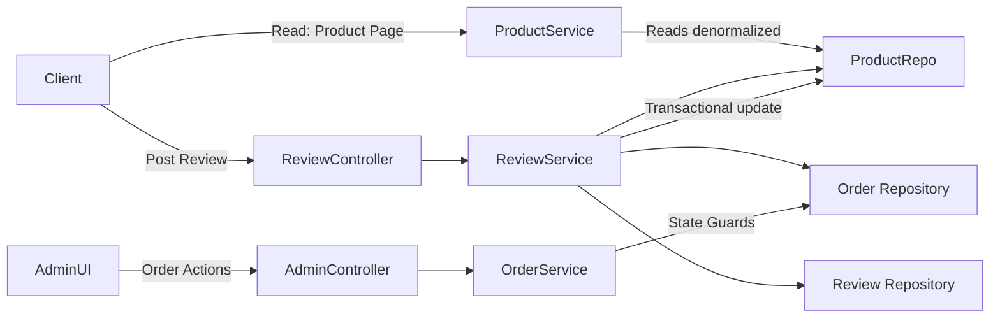

# 🚀 Day 8 — Social Proof Architecture & Operational Control

> **High-impact summary:** implemented a production-ready verified-review system, idempotent upsert flow for reviews, denormalized rating metrics, and a secure admin state-machine for order lifecycle control.

---

[](https://www.oracle.com/java/) [](https://spring.io/projects/spring-boot) [](LICENSE)

## Table of Contents

1. [Overview](#overview)
2. [Why this matters](#why-this-matters)
3. [Key engineering patterns](#key-engineering-patterns)

   * Denormalized Performance Optimization
   * Idempotent Review Upsert
   * Verified Buyer Gatekeeper
   * Secure Admin State-Machine
4. [Architecture diagram (high level)](#architecture-diagram-high-level)
5. [Code highlights & patterns](#code-highlights--patterns)

   * Upsert (pseudo / Spring Data JPA)
   * Atomic rating update logic
   * Verified-purchase validation (repository pattern)
   * Admin state transition guards
6. [Math: Weighted mean adjustment formula](#math-weighted-mean-adjustment-formula)
7. [Tech stack & decisions](#tech-stack--decisions)
8. [Roadmap](#roadmap)
9. [How to reuse / integrate this work](#how-to-reuse--integrate-this-work)
10. [Call to action](#call-to-action)

---

## Overview

This milestone elevates the backend from CRUD to **System Intelligence**. The focus is trust (verified reviews), consistency (idempotent upserts and denormalized metrics), and control (secure, validated admin operations).

The implementation is designed for production: transactionally-safe, horizontally scalable, and resilient to abuse patterns like review-bombing or BOLA.

---

## Why this matters

* **Performance:** Avoids realtime heavy aggregation queries on hot reads.
* **Trust:** Verified purchase checks improve review signal quality.
* **Correctness:** Idempotent flows and state-machine guards reduce bugs and fraud.
* **Security:** Implicit authorization reduces BOLA risks by avoiding direct object identifiers from clients.

---

## Key engineering patterns

### 1. Denormalized Performance Optimization

Persist `averageRating` and `totalReviews` on the `Product` entity to serve millions of read requests without hitting a heavy `AVG()` every page view.

**Pattern:** Write-optimized denormalization with transactional synchronization in `ReviewService`.

**Benefits:** O(1) read for ratings, far fewer DB IOs under traffic.

### 2. Idempotent Review "Upsert" Logic

Implement `findByUserAndProduct()` → if present `update()` else `create()` — all inside a single transactional boundary.

**Behavior:** `One User = One Review` while allowing updates.

**Benefit:** Prevents duplicates and supports revision of feedback.

### 3. Verified Buyer Gatekeeper

Before accepting a review, system verifies there's an order row for the user and product with status `DELIVERED` or `RETURNED`.

**Pattern:** Cross-repository validation implemented inside service layer using `@Transactional(readOnly = true)` checks.

### 4. Secure Admin State-Machine

Order transitions can only happen through guarded pathways (e.g., `PENDING -> PAID -> SHIPPED -> DELIVERED`). Illegal jumps (e.g., `CANCELLED -> SHIPPED`) are rejected.

**Security:** Identity is pulled from `SecurityContext` and validated for RBAC — do not accept user IDs in request payloads for privileged operations.

---

## Architecture diagram (high level)



> Note: The mermaid diagram above maps the simple flow: verification from orders → upsert review → update product metrics atomically.

---

## Code highlights & patterns

Below are compact, copy-paste-ready snippets (pseudo-Java/Spring Boot flavor) showing the important patterns used.

### Idempotent Upsert (Spring Data JPA style)

```java
@Transactional
public Review upsertReview(Long userId, Long productId, ReviewDto dto) {
    Optional<Review> existing = reviewRepository.findByUserIdAndProductId(userId, productId);
    if (existing.isPresent()) {
        Review r = existing.get();
        r.setRating(dto.getRating());
        r.setComment(dto.getComment());
        reviewRepository.save(r);
        updateProductAggregatesOnEdit(productId, r.getOldRating(), r.getRating());
        return r;
    }

    Review created = new Review(userId, productId, dto.getRating(), dto.getComment());
    reviewRepository.save(created);
    updateProductAggregatesOnCreate(productId, created.getRating());
    return created;
}
```

### Verified Purchase Gatekeeper

```java
public boolean isVerifiedBuyer(Long userId, Long productId) {
    return orderRepository.existsByUserIdAndProductIdAndStatusIn(userId, productId, List.of(DELIVERED, RETURNED));
}
```

### Atomic rating update logic (concept)

```java
@Transactional
void updateProductAggregatesOnCreate(Long productId, double newRating) {
    Product p = productRepository.findByIdForUpdate(productId); // SELECT ... FOR UPDATE
    p.setTotalReviews(p.getTotalReviews() + 1);
    p.setAverageRating((p.getAverageRating() * (p.getTotalReviews()-1) + newRating) / p.getTotalReviews());
    productRepository.save(p);
}

@Transactional
void updateProductAggregatesOnEdit(Long productId, double oldRating, double newRating) {
    Product p = productRepository.findByIdForUpdate(productId);
    double total = p.getTotalReviews();
    p.setAverageRating((p.getAverageRating() * total - oldRating + newRating) / total);
    productRepository.save(p);
}
```

### Admin state transition guard (example)

```java
public void transitionOrderStatus(Long orderId, OrderStatus target) {
    Order o = orderRepository.findById(orderId).orElseThrow(...);
    if (!OrderStateMachine.isValidTransition(o.getStatus(), target)) {
        throw new IllegalStateException("Invalid transition");
    }
    // Implicit auth: principal from SecurityContext
    String actor = SecurityContextHolder.getContext().getAuthentication().getName();
    authorizeAdminAction(actor, o);
    o.setStatus(target);
    orderRepository.save(o);
}
```

---

## Math — Weighted mean adjustment formula

When a review is edited, compute the new average without recomputing full aggregation:

```
newAverage = (currentAverage * N - oldRating + newRating) / N
```

When adding a new review:

```
newAverage = (currentAverage * N + newRating) / (N + 1)
newN = N + 1
```

These are constant-time, precise updates that preserve floating-point consistency when executed within a transaction.

---

## Tech stack & decisions

* **Language:** Java 17
* **Framework:** Spring Boot 4.0
* **Persistence:** Spring Data JPA (Postgres) — `SELECT ... FOR UPDATE` where necessary
* **Security:** Spring Security with RBAC using `@PreAuthorize`
* **Other:** Kafka for async events (future), Redis for caching (future), MongoDB used elsewhere where denormalization patterns vary

**Why denormalize?** Read-heavy e-commerce product pages favor precomputed metrics to reduce tail-latency and DB CPU usage.

---

## Roadmap

* [x] Day 7: Multi-Role Dashboards & Financial Analytics
* [x] Day 8: Verified Reviews, Upsert Logic, Admin Operations
* [ ] Day 9: Media Support & Advanced Search (coming soon)

---

## How to reuse / integrate this work

1. Add `averageRating` and `totalReviews` columns to `product` table (migrations).
2. Add `findByUserIdAndProductId` to `ReviewRepository`.
3. Wrap review create/update flows in `@Transactional` service methods.
4. Consider optimistic vs pessimistic locking depending on throughput; `SELECT ... FOR UPDATE` for strict correctness.
5. Add `OrderRepository.existsByUserIdAndProductIdAndStatusIn(...)` to validate verified buyers.

---

## Call to action

If you found this useful:

* ⭐ Star the repo
* 🧭 Follow for daily deep dives into Spring Boot and production system design
* 🤝 Open an issue or PR if you want an annotated walkthrough or full example project

---

*Last updated: Day 8 — Social Proof Architecture & Operational Control*
