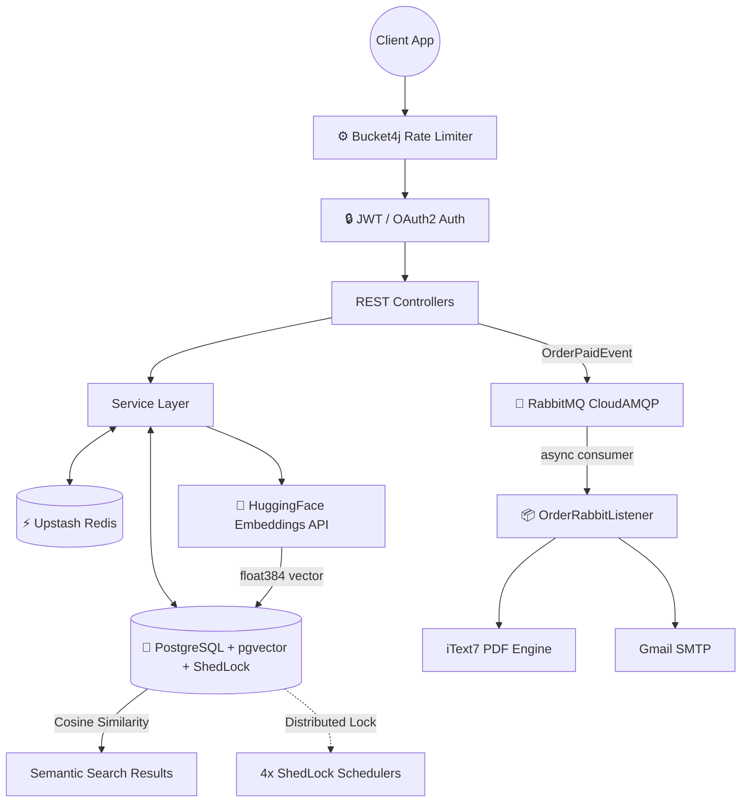

# 🛒 CognitoCart (Enterprise E-Commerce API)
### **Distributed Systems · Event-Driven Architecture · AI Semantic Search · Observability**

> **Why This Project Stands Out:** Most portfolio projects stop at basic CRUD. CognitoCart tackles the brutal edge cases that define **real production systems** — surviving double-charge payment failures with **Redis idempotency locks**, decoupling heavy workloads via **RabbitMQ event streams**, preventing race conditions under high concurrency using **Pessimistic DB Locks**, and pioneering **Mathematical AI Search** using 384-dimensional vectors.

[Core Architecture](#️-the-engineering) · [AI Features](#-ai--data-intelligence) · [API Domains](#-system-capabilities) · [Quick Start](#-quick-start-guide)

---

## 🏗️ The Engineering (How it solves real problems)

CognitoCart rejects simplified logic in favor of robust, distributed architecture. Here is exactly what it handles gracefully:

### 🛡️ Transactional Integrity & Concurrency (Flash Sales)
> **The Threat:** Two users click 'Checkout' on the last unit of a product simultaneously.
> **The Solution:** **Pessimistic Locking (`SELECT FOR UPDATE`)** in PostgreSQL. The checkout flow mathematically locks the row, evaluates promotions, deducts stock, and generates the invoice within a single immutable `@Transactional` boundary, preventing race conditions entirely.

### 💳 Webhook Idempotency & Resiliency
> **The Threat:** A user's internet drops after paying, or Razorpay's webhook fires twice.
> **The Solution:** Dual lifecycle modeling (`orderStatus` & `paymentStatus`) + a strictly **idempotent Redis `SETNX` lock layer**. An async DLQ processes HMAC-SHA256 verified webhooks — if a node fails mid-transaction, it retries safely without ever double-charging the customer.

### 🚄 Zero-Memory Streaming (Seller Analytics)
> **The Threat:** A seller requests a CSV export of 500,000 orders, crashing the JVM via Out-Of-Memory (OOM).
> **The Solution:** Implemented **`StreamingResponseBody`** combined with a JPA cursor (Fetch Size: 500) and manual `EntityManager.detach()`. Data streams directly to the network socket, keeping JVM memory footprint perfectly flat regardless of file size.

### 🔐 OAuth 2.0 Identity Server & Defenses
> **The Threat:** Malicious actors attempting to bypass password restrictions via social login vector endpoints.
> **The Solution:** A locked-down Spring Security filter chain tightly coupling **Google OAuth 2.0** profiles with internal accounts. It autonomously denies cross-hijacking attempts and issues dual-token JWTs securely.

---

## 🤖 AI & Data Intelligence

### Semantic Vector Search
Traditional `LIKE '%keyword%'` search fails when users think in sentences. CognitoCart converts product descriptions into **384-dimensional mathematical vectors** via HuggingFace AI, storing them in PostgreSQL (`pgvector`). 

| User Searches For | Top Result Returned | Why It Works |
|---|---|---|
| `"earphones for blocking noise while studying"` | Noise Cancelling Headphones | AI maps "earphones" → "headphones", "blocking noise" → "noise cancellation" |
| `"comfortable footwear for morning fitness routine"` | Running Shoes | AI maps "footwear" → "shoes", "fitness routine" → "marathon/jogging" |

### AI Review Summarization
Uses the **HuggingFace BART (Large CNN)** model to aggregate raw product review clusters into a single, high-impact sentiment summary (e.g. "Loved the bass, but the ear-tips are stiff"). Summaries are pre-computed by a **ShedLock-coordinated distributed background worker** for sub-millisecond retrieval.

### Deep Financial Intelligence
Admin and Seller dashboards powered by raw **JPQL Aggregate DTO Projections**. Calculates dynamic Customer Lifetime Value (CLV), Customer Churn Risk signals, and generates algorithmic "Product Quality Scores" based on return funnel metrics — providing actionable business intelligence natively.

---

## 🗺️ System Architecture

```mermaid
graph TD
    Client((Client App)) --> RL[⚙️ Bucket4j Rate Limiter]
    RL --> JWT[🔒 JWT / OAuth2 Auth]
    JWT --> API[REST Controllers]

    API --> SVC[Service Layer]
    API -->|OrderPaidEvent| MQ[🐇 RabbitMQ CloudAMQP]

    SVC <--> Cache[(⚡ Upstash Redis)]
    SVC <--> DB[(🐘 PostgreSQL + pgvector + ShedLock)]
    SVC --> AI[🤖 HuggingFace Embeddings API]

    MQ -->|async consumer| Worker[📦 OrderRabbitListener]
    Worker --> PDF[iText7 PDF Engine]
    Worker --> Email[Gmail SMTP]

    AI -->|float384 vector| DB
    DB -->|Cosine Similarity| SEARCH[Semantic Search Results]
    DB -.->|Distributed Lock| SCHED[4x ShedLock Schedulers]
```

---

## 💻 Tech Stack

| Layer | Technology | Purpose |
|---|---|---|
| **Runtime** | Java 21 / Spring Boot 3.4 | LTS stability, Virtual Threads readiness |
| **Database** | PostgreSQL + pgvector | ACID transactions + vector similarity search |
| **Message Broker** | RabbitMQ (CloudAMQP) + DLQ | Async event-driven PDF & email processing, zero message loss |
| **Distributed Lock** | ShedLock + JDBC | Safe multi-instance scheduler coordination |
| **AI Embeddings** | HuggingFace `all-MiniLM-L6-v2` | Semantic text embeddings |
| **Migrations** | Flyway | Deterministic, version-controlled schema evolution |
| **Cache & State** | Upstash Redis | JWT blacklists, OTPs, idempotency locks, read caching |
| **Payments** | Razorpay SDK | Orders, webhooks, instant refunds |
| **Observability** | Micrometer + Prometheus + Grafana | 200+ live metrics — JVM, DB pool, RabbitMQ, HTTP latency |

---

## 👨‍💻 Primary Architect

**Manish Kumar Singh**  
*Backend Systems Engineer · Java · Spring Boot · AI Integration · Distributed Systems*

I engineer resilient software capable of surviving heavy load and dynamic scaling requirements. CognitoCart demonstrates the full spectrum — from raw PostgreSQL schema design and distributed transaction management, to integrating live AI embeddings and asynchronous event-driven architectures.

  ⭐ Star this repo if you appreciate rigorous, production-grade software engineering!

