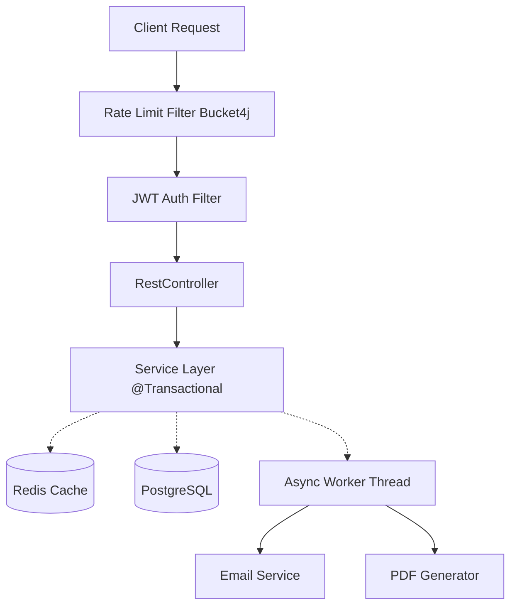

# 🛒 CognitoCart — Enterprise-Grade E-Commerce API

<div align="center">

[](https://openjdk.org/)
[](https://spring.io/projects/spring-boot)
[](https://www.postgresql.org/)
[](https://upstash.com/)
[](https://razorpay.com/)
[](https://spring.io/projects/spring-security)
[](LICENSE)

**A high-performance, production-ready REST API architected to solve real-world e-commerce challenges.**<br>
Built entirely solo to demonstrate mastery over distributed locks, payment idempotency, secure auth flows, and scalable data design.

[📖 Interactive API Docs](#-api-domain-overview) · [🚀 Quick Start](#-getting-started-local-development) · [🏗️ Architecture](#️-architecture--system-design) · [🗺️ Roadmap](#️-roadmap)

</div>

---

## 🎯 Why This Project Stands Out

Most portfolio projects stop at basic CRUD. **CognitoCart** is built to handle the edge cases that define real production systems. If you're an engineering manager evaluating this repository, here is what this codebase demonstrates:

### 🛡️ 1. Transactional Integrity & Concurrency
- **The Problem:** Two users check out the last iPhone simultaneously.
- **The Solution:** Implemented **Pessimistic Locking (`SELECT FOR UPDATE`)** in PostgreSQL. The checkout flow atomically locks the stock rows, recalculates the cart, deducts stock, and creates the order within a single `@Transactional` boundary. Zero oversells, guaranteed.

### 💳 2. Payment Idempotency & Webhooks
- **The Problem:** Frontend payment confirmation drops, or webhooks hit the server twice.
- **The Solution:** Dual lifecycle tracking (`orderStatus` vs `paymentStatus`). Integrated Razorpay with **HMAC-SHA256 signature verification** and an async webhook listener. The promotional logic is strictly idempotent — safe to retry indefinitely without double-crediting.

### 🔒 3. Enterprise Authentication (True Logout)
- **The Problem:** Standard JWTs cannot be revoked before expiration.
- **The Solution:** Designed a **Redis-backed token blacklist**. Upon logout or password reset, the specific token's `jti` (JWT ID) is written to Redis with a TTL matching its remaining life. Subsequent requests are rejected instantly. Combines the stateless scaling of JWT with the security of server-side state.

### 📦 4. Scalable Data Architecture
- **The Problem:** E-commerce categories are deeply nested (Electronics → Smartphones → Apple).
- **The Solution:** Engineered a recursive self-referencing `Category` entity with eager/lazy fetch optimization. Supported by a robust Schema-First approach using **Flyway** for deterministic database migrations.

---

## ✨ Core Capabilities

### 🏢 B2B / B2C Workflows
- **Multi-Tenant Roles:** Independent flows for `ADMIN`, `SELLER`, and `CUSTOMER`.
- **Seller KYC:** Onboarding approval pipeline with automated email notifications.
- **Dynamic Pricing:** 5-stage checkout pipeline mapping Gross Subtotal → Coupon Offsets → Net Subtotal → Delivery Fees → Final Charge.

### 🚦 Performance & Resilience
- **Rate Limiting:** Per-IP token-bucket rate limiting via **Bucket4j + Redis** to prevent DDoS and brute-force attacks at the `OncePerRequestFilter` layer.
- **Cloud Image CDN:** Direct integration with **Cloudinary** for scalable product image hosting. Offloads binary delivery from the API server and prevents data loss in ephemeral deployments (e.g. Heroku/Docker).
- **Distributed Caching:** Cache-aside pattern via Spring `@Cacheable` using Upstash Redis. Heavily read data (product catalogs, categories) is served in sub-milliseconds with automatic invalidation on writes.
- **Async Operations:** `@Async` non-blocking email dispatcher using Thymeleaf templates. The API responds instantly while PDF invoices and welcome emails render and send in background threads.

### 🧾 Professional Fulfillment
- **Automated Refunds:** Cancellation triggers an immediate, automated Razorpay Refund API call and fires a premium refund receipt via email.
- **Dynamic PDF Invoices:** On-the-fly generation of iText7 PDF tax invoices featuring GSTIN, zebra-striping, and compliance disclaimers.
- **Shipment Tracking:** End-to-end status management tied into logistics (BlueDart/Delhivery) with strict state-machine guards enforcing immutable terminal states (`DELIVERED`, `CANCELLED`).

---

## 🏗️ Architecture & System Design

### Request Lifecycle

```mermaid
graph TD
    Client[Client Request] --> RL[Rate Limit Filter Bucket4j]
    RL --> JWT[JWT Auth Filter]
    JWT --> Controller[RestController]
    Controller --> Service[Service Layer @Transactional]
    
    Service -.-> Cache[(Redis Cache)]
    Service -.-> DB[(PostgreSQL)]
    Service -.-> Async[Async Worker Thread]
    
    Async --> Email[Email Service]
    Async --> PDF[PDF Generator]
```

### Stack Justification
| Technology | Role | "Why This?" |
|---|---|---|
| **Java 21 / Spring Boot 3.4** | Core Framework | LTS stability, ecosystem maturity, and Virtual Threads readiness. |
| **PostgreSQL 15** | Primary Datastore | Unmatched ACID compliance, JSONB support, and robust locking for financial data. |
| **Redis (Upstash)** | Cache & Fast State | Serverless, sub-ms latency. Used for JWT blacklisting, rate limiting, and OTPs. |
| **Cloudinary SDK** | Media Storage | Offloads expensive image storage & delivery. Essential for stateless containerized deployments. |
| **Flyway** | Schema Migrations | Enforces schema-first design. Prevents "works on my machine" Hibernate auto-DDL disasters. |
| **iText7 / Thymeleaf** | Document Generation | Programmatic PDF creation and robust HTML templating for professional customer communications. |

---

## 🚀 Getting Started (Local Development)

### 1. Prerequisites
- **Java 21** (Eclipse Temurin)
- **Maven 3.8+**
- **PostgreSQL 15+**
- **Upstash Redis** (Free tier)
- **Razorpay Test Account**

### 2. Environment Setup
```bash
git clone https://github.com/manish5200/CognitoCart.git
cd CognitoCart/smartcart

# Create the database
psql -U postgres -c "CREATE DATABASE cognitocart;"

# Setup config
cp src/main/resources/application-demo.yml src/main/resources/application.yml
```

Configure your `application.yml` (gitignored to prevent secret leaks). You must provide your own Postgres credentials, Redis URL, Gmail App Password, and Razorpay keys.

### 3. Launch
```bash
./mvnw spring-boot:run
```
*On first boot: Flyway runs all 13 migrations, seeds the admin account, and populates the 61-node category tree.*

### 4. Verify
Head to **`http://localhost:8080/swagger-ui.html`** to explore the fully documented OpenAPI 3 specification and interact with the endpoints directly.

---

## 📬 API Domain Overview

With over 50+ endpoints, the API is broken down into clean domain boundaries:

| Domain | Access | Purpose |
|---|---|---|
| `/auth/**` | Public | Signup, Login, Password Reset, OTP Verification |
| `/products/**` | Public/Seller | Catalog browsing, search, inventory management |
| `/orders/**` | Customer | Checkout, order history, invoice retrieval |
| `/payments/**` | Webhook | Cryptographically verified Razorpay callbacks |
| `/admin/**` | Admin | Platform revenue, KYC approvals, order dispatch |

---

## 🗺️ Roadmap

**Phase 1 — Auth Hardening** ✅
- [x] Redis JWT blacklist (True Logout)
- [x] Pessimistic locking for stock deductions
- [x] Email OTP verification blocking rogue checkouts

**Phase 2 — Fulfillment & Operations** ✅
- [x] Automated Razorpay refunds on cancellation
- [x] Dynamic iText7 PDF Tax Invoices
- [x] Shipment tracking data model + Courier API integration groundwork
- [x] N+1 Query optimization via native `COUNT(*)` metrics

**Phase 3 — Scale & Media** ✅
- [x] Cloudinary integration for scalable product image hosting CDN
- [x] Multi-address management for users
- [x] Advanced Admin Analytics dashboard with historical trendlines

**Phase 3.5 — Enterprise Operations** ✅
- [x] Cart Abandonment Background Job (`@Scheduled` cron)
- [x] Anonymous Guest Checkout with Redis session migration
- [x] Dead Letter Queue (DLQ) for webhook failure resilience

**Phase 4 — Intelligence**
- [ ] Semantic vector search (pgvector)
- [ ] Collaborative filtering recommendations
- [ ] ML-based anomaly detection for fraudulent orders

---

## 👨‍💻 Author

**Manish Kumar Singh**  
*Backend Engineer — Java · Spring Boot · Microservices*

I build robust software that solves business problems. This project is a testament to my ability to own a complex architecture from database schema to API delivery.

[](https://www.linkedin.com/in/maniish5200/)
[](https://github.com/manish5200)

<div align="center">
  <sub>⭐ If you appreciate clean code and rigorous engineering standards, consider leaving a star!</sub>
</div>
