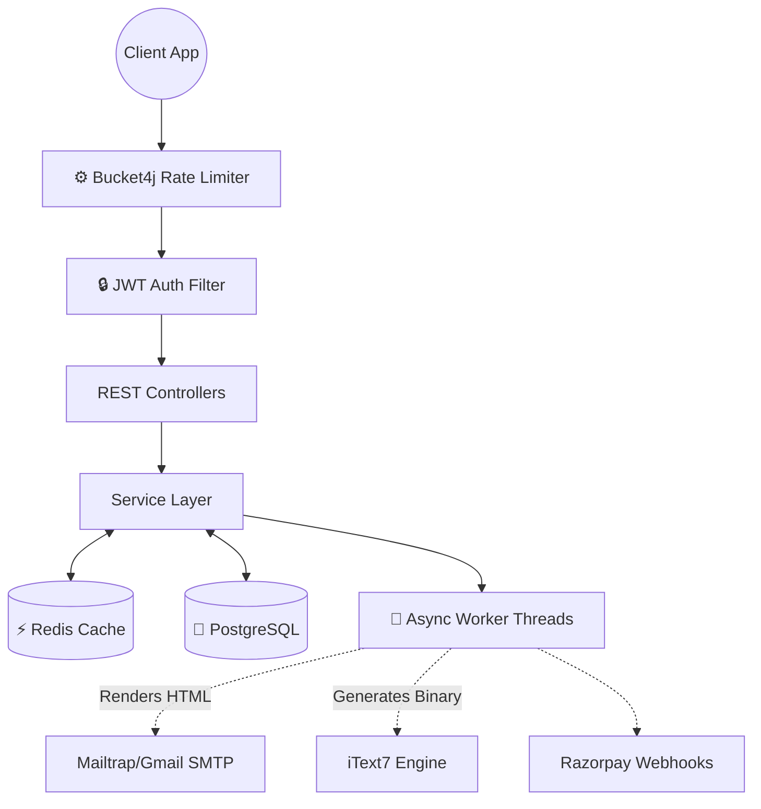

<div align="center">

# 🛒 CognitoCart
**An Enterprise-Grade, Zero-Compromise E-Commerce Architecture**

[](https://openjdk.org/)
[](https://spring.io/projects/spring-boot)
[](https://www.postgresql.org/)
[](https://upstash.com/)
[](https://razorpay.com/)

> Most portfolio projects stop at basic CRUD. **CognitoCart** is engineered to handle the brutal edge cases that define real production systems—preventing stock manipulation, surviving double-charge payment failures, and scaling securely.

[Explore the Code](#️-core-architectural-achievements) · [View API Domains](#-api-infrastructure) · [Run it Locally](#-quick-start-guide)

</div>

---

## 🏗️ The Engineering

CognitoCart rejects simplified logic in favor of robust, distributed architecture. If you're reviewing this repository, here is exactly what the backend handles gracefully:

### 🛡️ Transactional Integrity & Concurrency
> **The Threat:** Two users click 'Checkout' on the exact same pair of final sneakers.
> **The Solution:** Implemented **Pessimistic Locking (`SELECT FOR UPDATE`)** in PostgreSQL. Checkout workflows mathematically lock the physical row, evaluate promotions, map address offsets, deduct stock, and generate the invoice within a single immutable `@Transactional` boundary.

### 💳 Webhook Idempotency & Resiliency
> **The Threat:** A user's internet drops immediately after paying Razorpay, or Razorpay's API fires the webhook twice simultaneously.
> **The Solution:** Dual lifecycle modeling (`orderStatus` & `paymentStatus`). Integrated a strictly **idempotent Redis `SETNX` lock layer**. An async Dead Letter Queue (DLQ) listens to HMAC-SHA256 verified webhooks—if a node fails halfway through, the transaction is retried safely without double-charging the customer.

### 🔒 Enterprise Identity Architecture (True Logout)
> **The Threat:** Malicious actors steal standard JWTs, or users click "Logout" but the JWT simply lives on elsewhere.
> **The Solution:** Built a highly-secure **Redis-backed token blacklist**. The JWT `jti` (Token Identifier) isn't just discarded—it is stamped into Redis with a TTL replicating its remaining lifespan. Any subsequent backend entry is aggressively intercepted and denied.

---

## ✨ System Capabilities

<details open>
<summary><b> B2B / B2C Operations</b></summary>
<br>

- **Multi-Tenant Scopes:** Heavily restricted endpoint logic isolating `ADMIN`, `SELLER`, and `CUSTOMER` payloads natively.
- **Dynamic Pricing Engine:** 5-stage checkout pipeline applying Base Prices → Coupon Validations → targeted BOGO/Category Discounts → Delivery Offsets → Net Payable.
- **Seller KYC Pipeline:** Approval lifecycle for third-party sellers gated by global Admins.

</details>

<details open>
<summary><b> Performance & Scale</b></summary>
<br>

- **Autonomous Background Masterminds:** Engineered a highly aggressive Spring `@Scheduled` thread that scans PostgreSQL every 10 seconds for Flash Sales, dynamically generating native HTML FOMO tables via Thymeleaf, and blasting emails to Users with exact timestamp-locks to prevent spam.
- **DDoS Mitigation:** Active per-IP Token Bucket rate limiting via **Bucket4j** built directly into the Spring Security configuration.
- **Cloud Content Delivery:** Direct binary integration with the **Cloudinary CDN** ensures horizontal container scalability with no local disk dependency.
- **Sub-Millisecond Caching:** `@Cacheable` directives tied to **Upstash Redis**, dramatically offloading repetitive Product and Category DB queries with native eviction triggers.

</details>

<details open>
<summary><b> Automated Logistics</b></summary>
<br>

- **Instant Refund Processing:** Cancellation protocols autonomously invoke Razorpay's Reversal API and instantly dispatch `rfnd_XXXXX` receipts to customers.
- **Dynamic PDF Rendering:** Heavyweight on-the-fly PDF generation using **iText7**, stamping absolute GSTIN variables, zebra-striped tables, and mathematical delivery dates into clean tax documentation.
- **Logistics Machine:** Strict mathematical state locks forcing shipments to traverse `PLACED` → `SHIPPED` → `OUT_FOR_DELIVERY` without capability of illegal backward traversals.

</details>

---

## 🗺️ System Architecture


```mermaid
graph TD
    Client((Client App)) --> RL[⚙️ Bucket4j Rate Limiter]
    RL --> JWT[🔒 JWT Auth Filter]
    JWT --> API[REST Controllers]
    
    API --> SVC[Service Layer]
    
    SVC <--> Cache[(⚡ Redis Cache)]
    SVC <--> DB[(🐘 PostgreSQL)]
    SVC --> ASYNC[🔄 Async Worker Threads]
    
    ASYNC -.->|Renders HTML| Email[Mailtrap/Gmail SMTP]
    ASYNC -.->|Generates Binary| PDF[iText7 Engine]
    ASYNC -.-> Webhook[Razorpay Webhooks]
```

---

## 💻 Tech Stack

- **Framework:** `Java 21` / `Spring Boot 3.4` (LTS stability & Virtual Threads readiness)
- **Persistance:** `PostgreSQL 15` (ACID rigor, JSONB) & `Flyway` (Determinative Schema Migrations)
- **State & Scalability:** `Upstash Redis` (JWT Blacklists, OTPs, Idempotency Locks, Sub-ms Read Caching)
- **Media:** `Cloudinary CDN SDK`
- **Render Engine:** `iText7` & `Thymeleaf`

---

## 🚀 Quick Start Guide

### 1. Prerequisites
You will need **Java 21+**, **Maven 3.8+**, and an active instance of **PostgreSQL** & **Redis**.

### 2. Initialization
```bash
git clone https://github.com/manish5200/CognitoCart.git
cd CognitoCart/smartcart

# Instantiate PostgreSQL Database
psql -U postgres -c "CREATE DATABASE cognitocart;"
```
*Note: You must construct your own `application.yml` incorporating your private Redis URL, Email SMTP keys, Cloudinary tokens, and Razorpay Sandbox Keys.*

### 3. Server Ignition
```bash
./mvnw spring-boot:run
```
> *On server start, Flyway will hijack the boot process, aggressively injecting 18 Database migrations, seeding global Admins, dropping anti-spam columns, and populating 61 category nodes.*

### 4. Direct Testing
Navigate directly to **`http://localhost:8080/swagger-ui.html`** to browse over 50+ thoroughly structured OpenAPI endpoints.

---

## 🛣️ Engineering Roadmap

<details>
<summary><b>View Completed Phases (1-3.9)</b></summary>

- **Phase 1 — Auth Hardening:** Redis JWT Blacklists, Pessimistic Stock Locks, Secure OTP verifications.
- **Phase 2 — Fulfillment:** Automated Razorpay refunds, iText7 PDFs, Logistical state machines.
- **Phase 3 — Scale:** Cloudinary Integration, Robust Data modeling, Advanced JPQL analytics.
- **Phase 3.5 — Operations:** DLQs for failed webhooks, Guest-to-User cart migrations.
- **Phase 3.9 — Pre-AI Architecture:** Global `@SoftDelete`, Idempotency Locks, BOGO Targeted Engine, and autonomous Wishlist HTML Schedulers synced with Daily Rotated Appenders.
</details>

**Phase 4 — Artificial Intelligence & Advanced Algorithms** 🤖 (In Progress)
- [ ] **Semantic Vector Search**: Integrate PostgreSQL `pgvector` to allow users to search by numerical mathematical meaning rather than exact strings.
- [ ] **Collaborative Filtering**: "Customers who bought this item also bought..." mathematical recommendation clusters.
- [ ] **AI Review Summarization**: Transmit heavy review clusters to an LLM to render instant bullet-point sentiment takeaways.

**Phase 5 — Cloud DevOps & Distributed Systems** ☁️ (Upcoming)
- [ ] **Distributed Schedulers**: Upgrade native `@Scheduled` jobs with `ShedLock` to coordinate the Wishlist background engine safely across multiple load-balanced AWS EC2 nodes.
- [ ] **High-Availability**: Full backend containerization via Docker.
- [ ] **CI/CD Pipeline**: GitHub Actions auto-build, audit, and image deployment.

---

## 👨‍💻 Primary Engineer

**Manish Kumar Singh**  
*Backend Systems Engineer | Java · Spring Boot · Microservices*

I engineer resilient software capable of surviving heavy abuse and dynamic scaling bounds. This API stands as a testament to my ability to blueprint and command complex architecture from raw schema definitions directly to network deployment.

[](https://www.linkedin.com/in/maniish5200/)
[](https://github.com/manish5200)

<div align="center">
  <sub>⭐ Leave a star if you appreciate rigorous software design standards!</sub>
</div>
