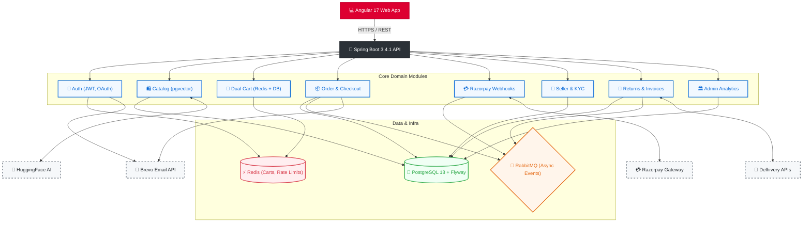
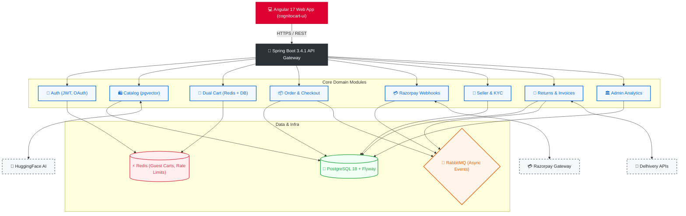

# 🛒 CognitoCart — Production-Grade E-Commerce Backend API

<div align="center">

> **A battle-hardened Full-Stack E-Commerce Platform engineered for scale, security, and real-world complexity.**
> Features a Spring Boot 3 REST API and a dynamic Angular 17+ Frontend covering the complete lifecycle:
> Auth → Catalog → Cart → Checkout → Payment → Shipment → Returns → Analytics → AI Search.

[](https://openjdk.org/projects/jdk/17/)
[](https://spring.io/projects/spring-boot)
[](https://angular.dev/)
[](https://github.com/pgvector/pgvector)
[](https://upstash.com/)
[](https://www.rabbitmq.com/)
[](https://cognitocart-api.onrender.com)
[](https://razorpay.com/)
[](https://www.delhivery.com/)
[](https://brevo.com/)
[](https://github.com/features/actions)

### 🌐 [Live App → cognitocart.vercel.app](https://cognitocart.vercel.app/)
### 🔌 [Live API → cognitocart-api.onrender.com](https://cognitocart-api.onrender.com/swagger-ui/index.html)

</div>

---

## 📋 Table of Contents

- [Live Deployment](#-live-deployment)
- [Architecture Overview](#️-architecture-overview)
- [Technology Stack](#-technology-stack)
- [Module Structure](#-module-structure)
- [Core Domain Concepts](#-core-domain-concepts)
- [Security Model](#️-security-model--idor-prevention)
- [Email Infrastructure](#-email-infrastructure)
- [On-the-Fly PDF Invoicing](#-on-the-fly-pdf-invoicing)
- [Multi-Vendor & Logistics](#-multi-vendor--logistics)
- [Flash Sale Engine](#-flash-sale-engine)
- [API Reference](#-api-reference)
- [Scheduled Jobs](#️-scheduled-jobs)
- [Analytics Capabilities](#-analytics-capabilities)
- [Running Locally](#️-running-locally)
- [Engineering Highlights](#-engineering-highlights)

---

## 🚀 Live Deployment

| Service | URL |
|---|---|
| **Frontend App** | https://cognitocart.vercel.app |
| **REST API** | https://cognitocart-api.onrender.com |
| **Swagger UI** | https://cognitocart-api.onrender.com/swagger-ui/index.html |
| **Health Check** | https://cognitocart-api.onrender.com/actuator/health |
| **Metrics** | https://cognitocart-api.onrender.com/actuator/prometheus |

> **Platform:** Render (Free Tier) · **Profile:** `prod` · **Port:** `10000`
> **Database:** PostgreSQL 18 (Render) · **Cache:** Redis (Upstash) · **MQ:** RabbitMQ (CloudAMQP)

---

## 🏗️ Architecture Overview


```mermaid
graph TD
    classDef frontend fill:#dd0031,stroke:#c3002f,stroke-width:2px,color:#fff;
    classDef gateway fill:#2b3137,stroke:#24292e,stroke-width:2px,color:#fff;
    classDef domain fill:#f1f8ff,stroke:#0366d6,stroke-width:2px,color:#0366d6;
    classDef db fill:#f0fff4,stroke:#28a745,stroke-width:2px,color:#28a745;
    classDef cache fill:#ffeef0,stroke:#d73a49,stroke-width:2px,color:#d73a49;
    classDef mq fill:#fff5eb,stroke:#e36209,stroke-width:2px,color:#e36209;
    classDef ext fill:#f6f8fa,stroke:#6a737d,stroke-width:2px,color:#24292e,stroke-dasharray:5;

    Clients["💻 Angular 17 Web App"] -->|HTTPS / REST| API["🚀 Spring Boot 3.4.1 API"]
    class Clients frontend
    class API gateway

    subgraph "Core Domain Modules"
        Auth["🔐 Auth (JWT, OAuth)"]
        Catalog["🛍️ Catalog (pgvector)"]
        Cart["🛒 Dual Cart (Redis + DB)"]
        Order["📦 Order & Checkout"]
        Payment["💳 Razorpay Webhooks"]
        Seller["🏬 Seller & KYC"]
        Returns["🔄 Returns & Invoices"]
        Admin["🏛️ Admin Analytics"]
    end

    API --> Auth
    API --> Catalog
    API --> Cart
    API --> Order
    API --> Payment
    API --> Seller
    API --> Returns
    API --> Admin

    class Auth,Catalog,Cart,Order,Payment,Seller,Returns,Admin domain

    subgraph "Data & Infra"
        DB[("🐘 PostgreSQL 18 + Flyway")]
        Redis[("⚡ Redis (Carts, Rate Limits)")]
        RabbitMQ{"🐇 RabbitMQ (Async Events)"}
    end

    class DB db
    class Redis cache
    class RabbitMQ mq

    Catalog --> DB
    Order --> DB
    Admin --> DB
    Seller --> DB
    Returns --> DB
    Cart --> Redis
    Auth --> Redis
    Payment --> RabbitMQ
    Order --> RabbitMQ
    Returns --> RabbitMQ

    Razorpay["💳 Razorpay Gateway"]
    Delhivery["🚚 Delhivery APIs"]
    HuggingFace["🧠 HuggingFace AI"]
    Brevo["📧 Brevo Email API"]

    class Razorpay,Delhivery,HuggingFace,Brevo ext

    Payment <--> Razorpay
    Returns <--> Delhivery
    Catalog <--> HuggingFace
    Auth --> Brevo
    Order --> Brevo
```

---

## 🚀 Technology Stack

| Layer | Technology | Purpose |
|---|---|---|
| **Frontend UI** | Angular 17+ / TypeScript | SPA — routing, form validation, AI search |
| **Backend API** | Spring Boot 3.4.1 / Java 17 | Core REST engine |
| **CI/CD** | GitHub Actions | Automated Maven builds |
| **Database** | PostgreSQL 18 + pgvector | Relational data + vector similarity search |
| **Schema** | Flyway 10 (41 migrations) | Versioned, auditable DB schema evolution |
| **Cache** | Redis (Upstash) | Guest carts, rate limit buckets, token blacklist |
| **ORM** | Spring Data JPA + Hibernate 6 | `@SoftDelete`, `@Lock(PESSIMISTIC_WRITE)`, `@QueryHints` |
| **Security** | Spring Security 6 + JWT (jjwt 0.12.6) | Stateless auth, method-level RBAC |
| **OAuth2** | Google Sign-In | Social login with automatic account linking |
| **Payments** | Razorpay SDK | Order creation, webhook verification, auto-refund |
| **Messaging** | RabbitMQ (CloudAMQP) | Async invoice delivery, mass email, DLQ pattern |
| **Email** | Brevo HTTP API | Transactional + marketing emails (no SMTP ports needed) |
| **PDF** | iText 7 | Professional PDF invoice generation |
| **CDN** | Cloudinary | Product + variant image upload/delete |
| **AI Embeddings** | HuggingFace Inference API | 384-dim semantic search vectors |
| **Rate Limiting** | Bucket4j + Redis | Per-IP token bucket (cluster-safe) |
| **Distributed Lock** | ShedLock + PostgreSQL | One-node cron execution guarantee |
| **Observability** | Micrometer + Prometheus + Actuator | Metrics, health checks, Grafana-ready |
| **API Docs** | SpringDoc OpenAPI 3 | Interactive Swagger UI |

---

## 📦 Module Structure

```
src/main/java/com/manish/smartcart/
│
├── 🔐 auth/                    # Registration, login, OTP, Google OAuth2, token refresh
├── 🛍️ product/                 # Products, Variants, Categories, AI Embeddings
│   ├── controller/             # ProductController, ProductVariantController
│   ├── service/                # ProductService, EmbeddingService, CategoryService
│   ├── model/                  # Product, ProductVariant, Category, ProductInsights
│   └── repository/             # Custom JPQL + native SQL queries + pgvector
│
├── 🛒 cart/                    # Dual-cart: PostgreSQL (auth users) + Redis (guests)
│   ├── service/CartService     # Math Engine: Subtotals, Coupon, Delivery, Flash override
│   ├── service/GuestCartService # TTL-based anonymous cart with merge-on-login
│   └── model/                  # Cart, CartItem, GuestCart, GuestCartItem
│
├── 📦 order/                   # Full checkout, payments, returns, cancellations
│   ├── service/OrderService    # Saga Pattern: TransactionTemplate for safe Razorpay calls
│   ├── service/ReturnService   # Customer-facing return/replacement requests
│   ├── service/ReturnAdminService # Admin approvals, stock restoration, refund triggers
│   ├── coupon/                 # Coupon CRUD, validation, per-user usage tracking
│   └── model/                  # Order, OrderItem, Shipment, Coupon, UserCouponUsage
│
├── 💳 payment/                 # Razorpay integration
│   ├── service/PaymentService  # Order ID creation
│   ├── service/WebhookService  # HMAC verification, status promotion
│   └── service/RazorpayRefundService # Full refund orchestration + DLQ replay
│
├── ⚡ sale/                    # Flash Sale Engine (3-tier: Admin → Seller → User)
│   ├── service/AdminSaleService
│   ├── service/SellerBulkSaleService # CSV bulk upload with IDOR ownership checks
│   └── job/FlashSaleActivationJob   # ShedLock-protected SCHEDULED→ACTIVE→ENDED
│
├── ❤️ wishlist/                # Toggle, one-click wishlist→cart, price-drop alerts
├── ⭐ review/                  # Verified-purchase reviews, upsert, rating distribution
├── 👤 user/                    # Profile, address book, loyalty points, store credit
├── 🔔 notification/            # In-app notifications + order status emails
├── 🏛️ admin/                   # Platform analytics, KYC approvals, order management
│
├── 🏗️ infrastructure/
│   ├── email/EmailService      # Brevo HTTP API (async, HTML, attachments)
│   ├── invoice/InvoiceService  # iText 7 PDF generation + RabbitMQ dispatch
│   ├── ai/AiSummarizationService
│   ├── returnpolicy/           # Chain of Responsibility policy resolution
│   └── ratelimit/              # Bucket4j per-IP rate limiting filter
│
├── 🔒 security/                # JWT filter, CustomUserDetails, SecurityConfig
├── 🗂️ shared/                  # Exceptions, Enums, Mappers, Constants
└── ⚙️ config/                  # RabbitMQ, Redis, ShedLock, Cloudinary, Swagger config
```

---

## 🧠 Core Domain Concepts

### 1. The 3-ID Security System (UUID → Long)

> **Problem solved:** Auto-incrementing `Long` IDs in URLs allow attackers to enumerate orders, guess user counts, and perform IDOR attacks.

```
External (Public API)         Internal (Database Engine)
─────────────────────         ─────────────────────────
UUID  →  Controller  →  Service (Translator)  →  Long PK
        (Edge Layer)    (Resolution Zone)       (Efficient Join)
```

Every entity carries **two identifiers**:
- `id` (Long): Internal PK — fast joins, never exposed in API responses
- `publicId` (UUID v4): External identifier — in all URLs, DTOs, and JSON responses

```java
// ✅ Pattern used across ALL services
public OrderResponse cancelOrder(UUID orderPublicId, Long userId) {
    Long orderId = orderRepository.findByPublicId(orderPublicId)
            .orElseThrow(() -> new ResourceNotFoundException(...))
            .getId();
    // business logic uses internal Long orderId
}
```

---

### 2. Product → Variant Architecture

```
Product  (Marketing Shell — what the catalog shows)
├── productName, slug, description, tags
├── price (base), averageRating, totalReviews
├── imageUrls[], embedding (384-dim pgvector)
└── ProductVariant[]  (purchasable SKUs — what the cart works with)
    ├── sku, barcode, displayLabel
    ├── attributes: { "Size": "L", "Color": "Red" }
    ├── stockQuantity, reservedQuantity
    ├── priceModifier (delta added to base price)
    └── availableStock = stockQuantity - reservedQuantity
```

---

### 3. OrderItem — Snapshot Architecture

```
OrderItem
├── LIVE REFERENCE (nullable — for stock ops)
│   └── variant → ProductVariant
│
└── IMMUTABLE SNAPSHOTS  ← Frozen at checkout, never changes
    ├── productNameSnapshot   "Nike Air Max 90"
    ├── skuSnapshot           "NIKE-AIR-L-RED"
    ├── variantLabelSnapshot  "Navy Blue / UK 9"
    ├── priceAtPurchase       ₹4,999.00
    └── imageUrlSnapshot      "https://cdn.cloudinary.com/..."
```

> Even if the seller renames, reprices, or deletes the product — every invoice remains 100% historically accurate.

---

### 4. Cart Math Engine

```
Gross Subtotal  =  Σ (priceAtAdding × quantity)
                          │
              ┌───────────▼───────────┐
              │    Promotion Engine   │
              │  FLAT / PERCENT /     │
              │  BOGO / FREE_SHIPPING │
              └───────────┬───────────┘
                          │
Net Subtotal  =  Gross − Discount
                          │
Delivery Fee:  Net < ₹599 → ₹50  |  Net ≥ ₹599 → ₹0
               (overridden to ₹0 by FREE_SHIPPING coupon)
                          │
Final Total   =  Net + Delivery Fee
```

**Flash Sale Override:** Active flash sale prices are applied and `priceAtAdding` is updated before totals are recalculated.

---

### 5. Checkout — Orchestration-Based Saga Pattern

```
placeOrder()
    │
    ├── TX 1 (Fast, ~50ms): buildAndPersistOrder()
    │       ├── Load cart + user with email-verified guard
    │       ├── Sort CartItems by variantId → Deadlock prevention
    │       ├── Per item:
    │       │   ├── SELECT FOR UPDATE (Pessimistic Write Lock)
    │       │   ├── Re-check availableStock
    │       │   ├── Check flash sale price deviation ≤ ₹0.05
    │       │   ├── Atomic flash sale unit increment (@Modifying native SQL)
    │       │   ├── Deduct stockQuantity
    │       │   └── Freeze 5 snapshots → OrderItem
    │       ├── Apply coupon, calculate total
    │       ├── Snapshot ReturnPolicy as JSONB
    │       └── SAVE Order → DB connection RELEASED ✅
    │
    ├── NETWORK I/O (~3–5s): Razorpay HTTP call
    │       ← Zero DB connections held during this phase
    │       └── If fails → compensating TX cancels order + restores stock
    │
    └── TX 2 (Fast, ~20ms): Attach razorpayOrderId + clearCart
```

---

### 6. Split-Tender Checkout & Store Credit

```
1. Gross Subtotal  = Σ (Price × Qty)
2. Net Subtotal    = Gross - Promo Discount - (Loyalty Points ÷ 10)
3. Final Total     = Net + Delivery Fee
4. Gateway Payable = Final Total - Applied Store Credit Wallet
```

- **100% Wallet/Points:** If `Gateway Payable == 0`, Razorpay call is bypassed → instant PAID.
- **Smart Refund Routing:** On cancellation, system splits refund: wallet portion → Store Credit, bank portion → Razorpay refund API.

---

### 7. AI Semantic Search

```
User query: "earphones for studying in a noisy café"
      │
      ▼
EmbeddingService → HuggingFace API → float[384] vector
      │
      ▼
ProductRepository.findBySimilarity():
  SELECT * FROM products
  WHERE embedding IS NOT NULL
  ORDER BY embedding <=> CAST(:queryVector AS vector)
  LIMIT :limit
      │
      ▼
Returns: "Noise-Cancelling Headphones" (zero keyword overlap)
```

> `ReviewSummarizationScheduler` runs nightly at 3 AM — batches all product reviews through HuggingFace and stores AI summaries back on the product record.

---

## 🛡️ Security Model & IDOR Prevention

| Layer | Mechanism | Detail |
|---|---|---|
| **Authentication** | Stateless JWT (HS256) | 15-min access token + 30-day refresh token |
| **Refresh Tokens** | Redis blacklist | Logout invalidates tokens instantly across cluster |
| **IDOR Prevention** | UUID public IDs | All external URLs use UUIDs — internal Longs never exposed |
| **RBAC** | `@PreAuthorize` method-level | Separate role guards: CUSTOMER / SELLER / ADMIN |
| **Rate Limiting** | Bucket4j + Redis | 20 req/10s per IP, cluster-safe |
| **Input Validation** | `@Valid` + Bean Validation | Applied to 100% of request DTOs |
| **Passwords** | BCrypt strength 10 | Standard industry hashing |
| **Payment Integrity** | Razorpay HMAC-SHA256 | Every webhook cryptographically verified |
| **Upload Security** | `FileValidator` | MIME type + extension + size checked before Cloudinary |
| **Email Verification** | OTP on registration | Orders blocked until email is verified |
| **IDOR (Orders)** | 404 not 403 | Prevents valid ID enumeration |
| **Flash Sale** | `@Modifying` atomic SQL | Bypasses Hibernate L1 cache, prevents overselling |

---

## 📧 Email Infrastructure

CognitoCart uses **[Brevo](https://brevo.com) HTTP API** for all transactional and marketing email delivery.

### Why Brevo over SMTP?

| Requirement | Decision |
|---|---|
| Render free tier blocks SMTP (25, 465, 587) | Brevo uses pure HTTPS (port 443) — always open |
| No custom domain | Brevo allows individual sender email verification |
| Free tier limit | 300 emails/day — sufficient for portfolio/startup |
| PDF attachments (invoices) | Supported via Base64 in JSON payload |
| Async delivery | All sends are `@Async` — never blocks request thread |

### Emails Sent

| Trigger | Description |
|---|---|
| User registration | Welcome + OTP verification |
| OTP resend | OTP email |
| Password reset | Reset link |
| Order placed | Confirmation + PDF invoice attachment |
| Order status update | Shipping/delivery notification |
| Refund processed | Refund confirmation |
| Flash sale created | Seller invite fan-out (via RabbitMQ, 50k+) |
| Cart abandonment | Daily reminder (scheduled job) |
| Wishlist price drop | Alert email (scheduled, 14-day cooldown) |
| KYC approved/rejected | Seller notification |

---

## 📄 On-the-Fly PDF Invoicing

When `GET /api/v1/orders/{orderId}/invoice` is called:
1. `OrderQueryService` runs a single JPQL `JOIN FETCH` — no lazy load issues
2. `InvoiceService` (iText 7) renders an Amazon-style PDF in memory
3. Raw `byte[]` streamed with `Content-Disposition: attachment` — triggers browser download
4. **Security:** IDOR-protected for customers; Admins can pull any invoice globally

---

## 🚚 Multi-Vendor & Logistics

- **Seller KYC:** Strict KYC flow (Pending → In Review → Verified). Unverified sellers blocked from listing.
- **Data Isolation:** `SellerController` enforces absolute data isolation — sellers access only their own products/orders.
- **N+1 Elimination:** Seller order dashboard uses two-step DB pagination — hundreds of orders in 2 queries.
- **Logistics (Delhivery):** Automated AWB (Airway Bill) generation and webhook-driven tracking updates.

---

## ⚡ Flash Sale Engine

### 3-Tier Role Architecture

```
┌──────────────────────────────────────────────────────────────────┐
│  TIER 1 — ADMIN                                                  │
│  Creates global sale events · Sets time window                   │
│  Approves / Rejects seller-submitted SKUs via QC review          │
├──────────────────────────────────────────────────────────────────┤
│  TIER 2 — SELLER                                                 │
│  Opts-in individual SKUs (single form or Bulk CSV upload)        │
│  Submissions default to PENDING until Admin approves             │
│  IDOR check: can only submit SKUs they own                       │
├──────────────────────────────────────────────────────────────────┤
│  TIER 3 — USER                                                   │
│  Cart auto-detects active flash sale → applies discounted price  │
│  Checkout re-validates price and atomically decrements quotas    │
└──────────────────────────────────────────────────────────────────┘
```

### Mass Email Fan-Out (RabbitMQ)

```
POST /api/v1/admin/sales/events
      │
   ┌──┴──────────────────────────────┐
   ▼                                 ▼
 Save to DB               Publish FlashSaleCreatedEvent
 201 CREATED ✅                     │
 Admin unblocked!        FlashSaleNotificationListener
                          Page through Slice<SellerEmailProjection>
                          500 sellers/page → 1 message/seller
                                    │
                         queue.seller.email.individual
                         (50,000 tiny messages, ~200 bytes each)
                                    │
             ┌──────────────────────┼──────────────────────┐
             ▼                      ▼                       ▼
       Worker Thread 1        Worker Thread 2         Thread N
       sendMail(seller1)      sendMail(seller2)      (concurrency=5)
             │                      │
         Success ✅             Exception ❌
         Email sent             NACK → DLQ
```

### Key Design Decisions

| Concern | Solution |
|---|---|
| 10k concurrent checkouts overselling | `@Modifying` native `atomicallyIncrementUsedUnits` |
| Stale cart price exploit | Checkout rejects if price deviation > ₹0.05 |
| Bot draining flash stock | `maxUnitsPerUser` checked on add AND update |
| Seller discounting competitor SKUs | IDOR ownership check per CSV row |
| Admin blocked during 50k email send | RabbitMQ decouples creation from delivery |
| OOM loading 50k sellers | `Slice<SellerEmailProjection>` — only email + name |

---

## 🌐 API Reference

### Authentication

| Method | Endpoint | Auth | Description |
|---|---|---|---|
| POST | `/api/v1/auth/register` | Public | Register + send OTP email |
| POST | `/api/v1/auth/login` | Public | JWT access + refresh token |
| POST | `/api/v1/auth/verify-otp` | Public | Email OTP verification |
| POST | `/api/v1/auth/refresh-token` | Public | Rotate access token |
| POST | `/api/v1/auth/logout` | Bearer | Blacklist refresh token |
| GET | `/oauth2/authorization/google` | Public | Google OAuth2 redirect |

### Products & Catalog

| Method | Endpoint | Auth | Description |
|---|---|---|---|
| GET | `/api/v1/products` | Public | Paginated catalog |
| GET | `/api/v1/products/{slug}` | Public | Product detail |
| GET | `/api/v1/products/search` | Public | Filter by price, rating, category |
| GET | `/api/v1/products/search/semantic?q=...` | Public | AI semantic search |
| POST | `/api/v1/products` | SELLER | Create product + default variant |
| PUT | `/api/v1/products/{id}` | SELLER | Update product details |
| DELETE | `/api/v1/products/{id}` | SELLER/ADMIN | Soft delete |

### Cart (Authenticated)

| Method | Endpoint | Auth | Description |
|---|---|---|---|
| POST | `/api/v1/cart/add` | CUSTOMER | Add variant |
| GET | `/api/v1/cart/summary` | CUSTOMER | Full cart with totals |
| DELETE | `/api/v1/cart/item/{variantPublicId}` | CUSTOMER | Remove item |
| PATCH | `/api/v1/cart/item/{variantPublicId}` | CUSTOMER | Update quantity |
| POST | `/api/v1/cart/apply-coupon?code=...` | CUSTOMER | Apply promo code |
| DELETE | `/api/v1/cart/remove-coupon` | CUSTOMER | Remove coupon |
| DELETE | `/api/v1/cart/clear` | CUSTOMER | Empty cart |

### Guest Cart (No Auth)

| Method | Endpoint | Auth | Description |
|---|---|---|---|
| POST | `/api/v1/guest-cart/{sessionId}/add` | Public | Add to Redis guest cart |
| GET | `/api/v1/guest-cart/{sessionId}` | Public | View guest cart |
| POST | `/api/v1/guest-cart/{sessionId}/merge` | CUSTOMER | Merge on login |

### Orders & Checkout

| Method | Endpoint | Auth | Description |
|---|---|---|---|
| POST | `/api/v1/orders/checkout` | CUSTOMER | Place order → Razorpay order ID |
| GET | `/api/v1/orders/my` | CUSTOMER | Paginated order history |
| DELETE | `/api/v1/orders/{orderPublicId}/cancel` | CUSTOMER | Cancel + refund + restore stock |
| POST | `/api/v1/orders/{orderPublicId}/return` | CUSTOMER | Return/replacement request |
| GET | `/api/v1/orders/{orderPublicId}/invoice` | CUSTOMER | Download PDF invoice |

### Payments

| Method | Endpoint | Auth | Description |
|---|---|---|---|
| POST | `/api/v1/payments/verify` | CUSTOMER | Frontend payment confirmation |
| POST | `/api/v1/payments/webhook` | Public | Razorpay server-to-server webhook |

### Reviews

| Method | Endpoint | Auth | Description |
|---|---|---|---|
| GET | `/api/v1/reviews/{productPublicId}` | Public | All reviews for a product |
| GET | `/api/v1/reviews/{productPublicId}/distribution` | Public | Star rating histogram |
| POST | `/api/v1/reviews/{productPublicId}` | CUSTOMER | Submit review + up to 3 images |
| DELETE | `/api/v1/reviews/{reviewPublicId}` | CUSTOMER | Delete own review |

### Flash Sale

| Method | Endpoint | Auth | Description |
|---|---|---|---|
| POST | `/api/v1/admin/sales/events` | ADMIN | Schedule sale event |
| PATCH | `/api/v1/admin/sales/items/{id}/review` | ADMIN | Approve / Reject SKU |
| POST | `/api/v1/seller/sales/items` | SELLER | Submit a single SKU |
| POST | `/api/v1/seller/sales/{eventId}/bulk-upload` | SELLER | CSV bulk upload |
| GET | `/api/v1/public/sales/live` | Public | Active events for banners |

### Admin Dashboard & Analytics

| Method | Endpoint | Auth | Description |
|---|---|---|---|
| GET | `/api/v1/admin/dashboard` | ADMIN | Revenue + low stock + top products |
| GET | `/api/v1/admin/analytics/clv` | ADMIN | Customer Lifetime Value ranking |
| GET | `/api/v1/admin/analytics/churn` | ADMIN | Churn risk detection |
| GET | `/api/v1/admin/analytics/category-revenue` | ADMIN | Category performance |
| GET | `/api/v1/admin/orders` | ADMIN | All orders (paginated) |
| PATCH | `/api/v1/admin/orders/{orderPublicId}/status` | ADMIN | Update order status |
| PATCH | `/api/v1/admin/returns/{returnId}/approve` | ADMIN | Approve return + trigger refund |

---

## ⏱️ Scheduled Jobs

| Job | Schedule | ShedLock | Purpose |
|---|---|---|---|
| `FlashSaleActivationJob` | Every 60s | ✅ | Activate / deactivate sale events |
| `OrderCleanupScheduler` | Every 5 min | ✅ | Cancel stale `PAYMENT_PENDING` orders > 15 min |
| `CartAbandonmentJob` | Daily 10 PM | ✅ | Email users with abandoned carts |
| `ReviewSummarizationScheduler` | Daily 3 AM | ✅ | AI batch review summarization |
| `WishlistConversionScheduler` | Daily 2 AM | ✅ | Price-drop alert emails (14-day cooldown) |

> **Why ShedLock?** Guarantees exactly-once execution across N horizontally scaled instances — no duplicate emails, no double stock deductions.

---

## 📊 Analytics Capabilities

| Domain | Metrics Available |
|---|---|
| **Revenue** | Total platform revenue · Daily trend (7-day) · Per-seller breakdown |
| **Inventory** | Low stock alerts per variant · Configurable threshold per SKU |
| **Products** | Top-selling globally (Admin) · Top-selling per seller |
| **Customers** | CLV ranking · Churn risk scoring · Dashboard (orders, spend, recent) |
| **Returns** | Return reason distribution · Defect matrix per product |
| **Exports** | Seller analytics CSV (streaming, memory-safe) |

---

## ⚙️ Running Locally

### Prerequisites

- Java 17+
- PostgreSQL 15+ with `pgvector` extension enabled
- Redis instance
- RabbitMQ broker (or CloudAMQP free tier)
- Brevo account (free tier) for email

### Setup

```bash
# Clone the repo
git clone https://github.com/manish5200/CognitoCart.git
cd cognitocart/smartcart

# Set environment variables (or update application.yml defaults):

# ─── Database ───
SPRING_DATASOURCE_URL=jdbc:postgresql://localhost:5432/cognitocart
SPRING_DATASOURCE_USERNAME=cognitocart
SPRING_DATASOURCE_PASSWORD=yourpassword

# ─── Redis ───
SPRING_DATA_REDIS_URL=redis://localhost:6379

# ─── RabbitMQ ───
RABBITMQ_HOST=localhost

# ─── Razorpay ───
RAZORPAY_KEY_ID=rzp_test_...
RAZORPAY_KEY_SECRET=your_secret
RAZORPAY_WEBHOOK_SECRET=your_webhook_secret

# ─── Cloudinary ───
CLOUDINARY_CLOUD_NAME=your_cloud
CLOUDINARY_API_KEY=your_key
CLOUDINARY_API_SECRET=your_secret

# ─── AI ───
HUGGINGFACE_API_KEY=hf_...

# ─── Email (Brevo) ───
BREVO_API_KEY=xkeysib-...
BREVO_FROM_EMAIL=your-verified-sender@gmail.com

# ─── Auth ───
JWT_SECRET_KEY=your_256bit_hex_secret

# Run!
./mvnw spring-boot:run -Dspring-boot.run.profiles=dev
```

### API Documentation (Local)

```
http://localhost:8080/swagger-ui/index.html
```

### Docker Compose (local infra)

```bash
# Starts PostgreSQL + Redis + RabbitMQ
docker-compose up -d
```

---

## 🏆 Engineering Highlights

| Challenge | Solution | Pattern |
|---|---|---|
| Overselling during flash sales | `SELECT FOR UPDATE` + `@Modifying` atomic increment | Pessimistic Locking |
| Razorpay call holding DB connection for 5s | `TransactionTemplate` programmatic boundary splitting | Saga Pattern |
| Split-tender math corruption | Immutable DB trackers (`walletAmountPaid`, `gatewayAmountPaid`) + atomic rollback | Ledger Routing |
| 5-7 day refund delays | Store Credit Wallet for instant zero-latency refunds | Financial Proxy |
| Long IDs enabling IDOR attacks | UUID `publicId` on every entity, Long only internal | 3-ID Security System |
| 50k emails blocking API thread | RabbitMQ fan-out, async workers, DLQ | Event-Driven Architecture |
| Price exploit via stale cart | Price deviation check ≤ ₹0.05 at checkout | Checkout Validation |
| Bot depleting flash sale stock | `maxUnitsPerUser` enforced on add AND update | Rate Enforcement |
| Product deleted = broken invoice | Snapshot all 5 metadata fields at checkout | Immutable Snapshots |
| Memory blowup loading 50k sellers | `Slice<Projection>`, 500/page, lightweight DTOs | Streaming Pagination |
| SMTP blocked on Render free tier | Brevo HTTP API over HTTPS — no SMTP ports needed | REST-Based Email |
| Spring Boot boot timeout on Render | `lazy-initialization: true` + `ddl-auto: none` | Startup Optimization |

---

<div align="center">

**Built with ❤️ by [Manish Chauhan](https://github.com/manish5200)**

*Engineered for scale. Secured by design. Deployed to production.*

[](https://cognitocart-api.onrender.com/swagger-ui/index.html)

</div>

<div align="center">

> **A battle-hardened Full-Stack E-Commerce Platform engineered for scale, security, and real-world complexity.**
> Features a Spring Boot 3 REST API and a dynamic Angular 17+ Frontend covering the complete lifecycle: Auth → Catalog → Cart → Checkout → Payment → Shipment → Returns → Analytics → AI Search.

[](https://openjdk.org/projects/jdk/17/)
[](https://spring.io/projects/spring-boot)
[](https://angular.dev/)
[](https://github.com/pgvector/pgvector)
[](https://upstash.com/)
[](https://www.rabbitmq.com/)
[](https://github.com/features/actions)
[](https://razorpay.com/)
[](https://www.delhivery.com/)

</div>

---

## 📋 Table of Contents

- [Architecture Overview](#️-architecture-overview)
- [Technology Stack](#-technology-stack)
- [Frontend Experience (Angular)](#-frontend-experience-angular-new)
- [Module Structure](#-module-structure)
- [Core Domain Concepts](#-core-domain-concepts)
- [Security Model](#-security-model--idor-prevention)
- [On-the-Fly PDF Invoicing](#-on-the-fly-pdf-invoicing-new)
- [Multi-Vendor & Logistics](#-multi-vendor--logistics)
- [Flash Sale Engine](#-flash-sale-engine)
- [API Reference](#-api-reference)
- [Scheduled Jobs](#-scheduled-jobs)
- [Analytics Capabilities](#-analytics-capabilities)
- [Running Locally](#️-running-locally)

---

## 🏗️ Architecture Overview


```mermaid
graph TD
    %% Styling
    classDef frontend fill:#dd0031,stroke:#c3002f,stroke-width:2px,color:#fff;
    classDef gateway fill:#2b3137,stroke:#24292e,stroke-width:2px,color:#fff;
    classDef domain fill:#f1f8ff,stroke:#0366d6,stroke-width:2px,color:#0366d6;
    classDef db fill:#f0fff4,stroke:#28a745,stroke-width:2px,color:#28a745;
    classDef cache fill:#ffeef0,stroke:#d73a49,stroke-width:2px,color:#d73a49;
    classDef mq fill:#fff5eb,stroke:#e36209,stroke-width:2px,color:#e36209;
    classDef ext fill:#f6f8fa,stroke:#6a737d,stroke-width:2px,color:#24292e,stroke-dasharray: 5 5;

    Clients["💻 Angular 17 Web App (cognitocart-ui)"] -->|HTTPS / REST| API["🚀 Spring Boot 3.4.1 API Gateway"]
    class Clients frontend
    class API gateway
    
    subgraph "Core Domain Modules"
        Auth["🔐 Auth (JWT, OAuth)"]
        Catalog["🛍️ Catalog (pgvector)"]
        Cart["🛒 Dual Cart (Redis + DB)"]
        Order["📦 Order & Checkout"]
        Payment["💳 Razorpay Webhooks"]
        Seller["🏬 Seller & KYC"]
        Returns["🔄 Returns & Invoices"]
        Admin["🏛️ Admin Analytics"]
    end
    
    API --> Auth
    API --> Catalog
    API --> Cart
    API --> Order
    API --> Payment
    API --> Seller
    API --> Returns
    API --> Admin

    class Auth,Catalog,Cart,Order,Payment,Seller,Returns,Admin domain

    subgraph "Data & Infra"
        DB[("🐘 PostgreSQL 18 + Flyway")]
        Redis[("⚡ Redis (Guest Carts, Rate Limits)")]
        RabbitMQ{"🐇 RabbitMQ (Async Events)"}
    end

    class DB db
    class Redis cache
    class RabbitMQ mq

    Catalog --> DB
    Order --> DB
    Admin --> DB
    Seller --> DB
    Returns --> DB
    
    Cart --> Redis
    Auth --> Redis
    
    Payment --> RabbitMQ
    Order --> RabbitMQ
    Returns --> RabbitMQ

    %% External
    Razorpay["💳 Razorpay Gateway"]
    Delhivery["🚚 Delhivery APIs"]
    HuggingFace["🧠 HuggingFace AI"]

    class Razorpay,Delhivery,HuggingFace ext

    Payment <--> Razorpay
    Returns <--> Delhivery
    Catalog <--> HuggingFace
```

---

## 🚀 Technology Stack

| Layer | Technology | Purpose |
|---|---|---|
| **Frontend UI** | Angular 17+ / TypeScript | Interactive Single Page Application (SPA), dynamic routing, form validation |
| **Backend API** | Spring Boot 3.4.1 / Java 17 | Core API engine (Records, Pattern Matching) |
| **CI/CD** | GitHub Actions | Automated Maven builds and test execution |
| **Database** | PostgreSQL 18.2 + pgvector | Relational data + Vector similarity search |
| **Schema** | Flyway 10.20.1 (35 migrations) | Versioned, auditable DB schema evolution |
| **Cache** | Redis (Upstash) | Guest carts, rate limit buckets, token blacklist |
| **ORM** | Spring Data JPA + Hibernate 6 | `@SoftDelete`, `@Lock(PESSIMISTIC_WRITE)`, `@QueryHints` |
| **Security** | Spring Security 6 + JWT (jjwt 0.12.6) | Stateless auth, method-level RBAC |
| **OAuth2** | Google Sign-In | Social login with automatic account linking |
| **Payments** | Razorpay SDK | Order creation, webhook verification, auto-refund |
| **Messaging** | RabbitMQ (CloudAMQP) | Async invoice delivery, mass email, DLQ pattern |
| **Email** | Spring Mail + Thymeleaf HTML | Transactional emails with rich templates |
| **PDF** | iText 7 | Professional PDF invoice generation |
| **CDN** | Cloudinary | Product + variant image upload/delete |
| **AI Embeddings** | HuggingFace Inference API | 384-dim semantic search vectors |
| **Rate Limiting** | Bucket4j + Redis | Per-IP token bucket (cluster-safe) |
| **Distributed Lock** | ShedLock + PostgreSQL | One-node cron execution guarantee |
| **Observability** | Micrometer + Prometheus + Actuator | Metrics, health checks, Grafana-ready |
| **API Docs** | SpringDoc OpenAPI 3 | Interactive Swagger UI |

---

## 💻 Frontend Experience (Angular) [NEW]

CognitoCart is not just an API; it features a rich, responsive **Angular Single Page Application (`cognitocart-ui`)** designed for performance and conversion.

*   **Dynamic Checkout Flow:** Streamlined checkout process with automated email-verification guards. If a user hasn't verified their email, the UI seamlessly prompts them before allowing payment.
*   **Admin & KYC Dashboard:** Comprehensive analytics remapping. Admins can view seller onboarding statuses, approve KYC requests, and monitor revenue churn.
*   **Seller Product Management:** Dedicated UI for sellers to manage inventory, track `stockQuantity` at the variant level, and organize category mappings.
*   **AI Search Integration:** The frontend connects directly to the backend's HuggingFace `pgvector` semantic search, allowing users to search using natural language (e.g., "headphones for noisy cafe").

---

## 📦 Module Structure

```
src/main/java/com/manish/smartcart/
│
├── 🔐 auth/                    # Registration, login, OTP, Google OAuth2, token refresh
├── 🛍️ product/                 # Products, Variants, Categories, AI Embeddings
│   ├── controller/             # ProductController, ProductVariantController
│   ├── service/                # ProductService, EmbeddingService, CategoryService
│   ├── model/                  # Product, ProductVariant, Category, ProductInsights
│   └── repository/             # Custom JPQL + native SQL queries + pgvector
│
├── 🛒 cart/                    # Dual-cart system: PostgreSQL (auth) + Redis (guest)
│   ├── service/CartService     # Math Engine: Subtotals, Coupon, Delivery, Flash override
│   ├── service/GuestCartService # TTL-based anonymous cart with merge-on-login
│   └── model/                  # Cart, CartItem, GuestCart, GuestCartItem
│
├── 📦 order/                   # Full checkout, payments, returns, cancellations
│   ├── service/OrderService    # Saga Pattern: TransactionTemplate for safe Razorpay calls
│   ├── service/ReturnService   # Customer-facing return/replacement requests
│   ├── service/ReturnAdminService # Admin approvals, stock restoration, refund triggers
│   ├── service/ShipmentService # Courier tracking attachment
│   ├── coupon/                 # Coupon CRUD, validation engine, per-user usage tracking
│   └── model/                  # Order, OrderItem, Shipment, Coupon, UserCouponUsage
│
├── 💳 payment/                 # Razorpay integration
│   ├── service/PaymentService  # Order ID creation
│   ├── service/WebhookService  # HMAC verification, status promotion
│   ├── service/RazorpayRefundService # Full refund orchestration
│   └── service/WebhookDlqService    # Replay failed webhook events
│
├── ⚡ sale/                    # Flash Sale Engine (3-tier: Admin → Seller → User)
│   ├── service/AdminSaleService # Event CRUD + RabbitMQ publish
│   ├── service/SellerSaleService # Single-item submission
│   ├── service/SellerBulkSaleService # CSV bulk upload with IDOR ownership checks
│   └── job/FlashSaleActivationJob   # ShedLock-protected SCHEDULED→ACTIVE→ENDED
│
├── ❤️ wishlist/                # Wishlist toggle, one-click wishlist-to-cart, price-drop alerts
├── ⭐ review/                  # Verified-purchase reviews, upsert logic, rating distribution
│   └── ReviewImages            # Cloudinary CDN integration for customer review photos (max 3)
│
├── 👤 user/                    # User profile, address book
│   ├── service/CustomerService # Dashboard, Loyalty Points tally, Store Credit Wallet balance
│   └── service/AddressService  # Address CRUD with UUID-based IDOR protection
│
├── 🔔 notification/            # In-app notifications, SMS, Order notifications
│   ├── service/InAppNotificationService # Create, paginate, mark-as-read
│   └── service/OrderNotificationService # Confirmation, status update, refund, delivery
│
├── 🏛️ admin/                   # Platform management and analytics
│   ├── controller/AdminController # UUID-secured admin endpoints
│   └── service/AdminService    # Dashboard, CLV, churn, category revenue
│
├── 🏗️ infrastructure/          # Cross-cutting concerns
│   ├── ai/AiSummarizationService # AI batch review summarizer
│   ├── email/EmailTemplateBuilder # Thymeleaf HTML email templates
│   ├── invoice/InvoiceService  # iText 7 PDF generation + RabbitMQ dispatch
│   ├── returnpolicy/           # Chain of Responsibility policy resolution
│   └── ratelimit/              # Bucket4j per-IP rate limiting filter
│
├── 🔒 security/                # JWT filter, CustomUserDetails, SecurityConfig
├── 🗂️ shared/                  # Exceptions, Enums, Mappers, Constants
│   ├── exception/              # GlobalExceptionHandler, ResourceNotFoundException, etc.
│   └── mapper/                 # OrderMapper, ProductMapper
│
└── ⚙️ config/                  # RabbitMQ, Redis, ShedLock, Cloudinary, Swagger config
```

---

## 🧠 Core Domain Concepts

### 1. The 3-ID Security System (UUID → Long)

> **Problem solved:** Auto-incrementing `Long` IDs in URLs allow attackers to enumerate orders, guess user counts, and perform IDOR attacks.

```
External (Public API)         Internal (Database Engine)
─────────────────────         ─────────────────────────
UUID  →  Controller  →  Service (Translator)  →  Long PK
        (Edge Layer)    (Resolution Zone)       (Efficient Join)
```

Every entity carries **two identifiers**:
- `id` (Long): Internal PK — fast joins, never exposed in API responses
- `publicId` (UUID v4): External identifier — in all URLs, DTOs, and JSON responses

**Resolution happens inside `@Transactional` service methods**, maintaining referential integrity:

```java
// ✅ Pattern used across ALL services
public OrderResponse cancelOrder(UUID orderPublicId, Long userId) {
    Long orderId = orderRepository.findByPublicId(orderPublicId)
            .orElseThrow(() -> new ResourceNotFoundException(...))
            .getId();
    // ... business logic uses internal Long orderId
}
```

---

### 2. Product → Variant Architecture

```
Product  (Marketing Shell — what the catalog shows)
├── productName, slug, description, tags
├── price (base), averageRating, totalReviews
├── imageUrls[], embedding (384-dim pgvector)
└── ProductVariant[]  (purchasable SKUs — what the cart works with)
    ├── sku, barcode, displayLabel
    ├── attributes: { "Size": "L", "Color": "Red" }
    ├── stockQuantity, reservedQuantity
    ├── priceModifier (delta added to base price)
    ├── sortOrder (controls default variant selection)
    └── availableStock = stockQuantity - reservedQuantity
```

> **Rule:** Every cart operation, checkout, and stock deduction targets a `ProductVariant` by `publicId`, never a `Product` directly.
> The default variant is resolved **at the DB level** via `ORDER BY sort_order LIMIT 1` — not in application memory.

---

### 3. OrderItem — Dual-Layer Design (Snapshot Architecture)

```
OrderItem
├── LIVE REFERENCE (nullable — for stock ops)
│   └── variant → ProductVariant
│
└── IMMUTABLE SNAPSHOTS  ← Frozen at checkout, never changes
    ├── productNameSnapshot   "Nike Air Max 90"
    ├── skuSnapshot           "NIKE-AIR-L-RED"
    ├── variantLabelSnapshot  "Navy Blue / UK 9"
    ├── priceAtPurchase       ₹4,999.00
    └── imageUrlSnapshot      "https://cdn.cloudinary.com/..."
```

> Even if the seller renames the product, changes the price, or soft-deletes the variant tomorrow — every invoice and receipt remains 100% historically accurate.

---

### 4. Cart Math Engine

```
                ┌─────────────────────────────────┐
                │    CartService.updateCartTotal   │
                └─────────────────┬───────────────┘
                                  │
  Gross Subtotal  =  Σ (priceAtAdding × quantity)
                                  │
                    ┌─────────────▼─────────────┐
                    │    Promotion Engine        │
                    │  FLAT / PERCENT / BOGO /   │
                    │  FREE_SHIPPING coupon       │
                    └─────────────┬─────────────┘
                                  │
  Net Subtotal  =  Gross − Discount Amount
                                  │
  Delivery Fee:  Net < ₹599 → ₹50  |  Net ≥ ₹599 → ₹0
                 (overridden to ₹0 by FREE_SHIPPING coupon)
                                  │
  Final Total   =  Net Subtotal + Delivery Fee
```

**Flash Sale Override:** If any cart item has an active flash sale, the real-time discounted price is applied and `priceAtAdding` is updated before the checkout totals are recalculated.

---

### 5. Checkout — Orchestration-Based Saga Pattern

```
placeOrder()
    │
    ├── TX 1 (Fast, ~50ms): buildAndPersistOrder()
    │       ├── Load cart + user with email-verified guard
    │       ├── Sort CartItems by variantId → Deadlock prevention
    │       ├── Per item:
    │       │   ├── SELECT FOR UPDATE (Pessimistic Write Lock)
    │       │   ├── Re-check availableStock vs. quantity ordered
    │       │   ├── Check flash sale price deviation ≤ ₹0.05
    │       │   ├── Atomic flash sale unit increment (@Modifying native SQL)
    │       │   ├── Deduct stockQuantity
    │       │   └── Freeze 5 snapshots → OrderItem
    │       ├── Apply coupon, calculate total
    │       ├── Snapshot ReturnPolicy as JSONB
    │       └── SAVE Order → DB connection RELEASED ✅
    │
    ├── NETWORK I/O (High-latency, ~3–5s): Razorpay HTTP call
    │       ← Zero DB connections held during this phase
    │       └── If fails → compensating TX cancels order + restores stock
    │
    └── TX 2 (Fast, ~20ms): Attach razorpayOrderId + clearCart
```

---

### 6. Return Policy — Chain of Responsibility

```
getApplicablePolicy(product):
  1. Check product-level ReturnPolicy  → return if found
  2. Check category-level ReturnPolicy → return if found
  3. Default: NON_RETURNABLE            → never throws NPE

→ Policy JSONB snapshot frozen into Order.returnPolicySnapshot at checkout
→ Customer rights are frozen at purchase time, even if seller updates policy later
```

---

### 7. AI Semantic Search

```
User query: "earphones for studying in a noisy café"
      │
      ▼
EmbeddingService → HuggingFace API → float[384] vector
      │
      ▼
VectorAttributeConverter → "[0.021,-0.455,...]"
      │
      ▼
ProductRepository.findBySimilarity():
  SELECT * FROM products
  WHERE embedding IS NOT NULL
  ORDER BY embedding <=> CAST(:queryVector AS vector)
  LIMIT :limit
      │
      ▼
Returns: "Noise-Cancelling Headphones" (zero keyword overlap)
```

> AI Review Summarizer (`ReviewSummarizationScheduler`) runs nightly at 3 AM, batching all product reviews through the HuggingFace API to generate concise AI summaries stored back on the product record.

---

### 8. Split-Tender Checkout Engine & Store Credit

```
1. Gross Subtotal  = Σ (Price × Qty)
2. Net Subtotal    = Gross - Promo Code Discount - (Loyalty Points ÷ 10)
3. Final Total     = Net Subtotal + Delivery Fee
4. Gateway Payable = Final Total - Applied Store Credit Wallet
```

Checkout handles complex split payments seamlessly:
- **100% Wallet/Points**: If `Gateway Payable == 0`, the Razorpay network call is bypassed entirely, transitioning instantly to PAID.
- **Smart Refund Routing**: When cancelling, customers choose `WALLET` (instant 100% store credit) or `ORIGINAL`. If `ORIGINAL`, the system automatically splits the refund: returning the precise wallet portion to the Store Credit Wallet, and firing a Razorpay API call for the exact bank portion.

---

## 🛡️ Security Model & IDOR Prevention

| Layer | Mechanism | Detail |
|---|---|---|
| **Authentication** | Stateless JWT (HS256) | 15-min access token + 30-day refresh token |
| **Refresh Tokens** | Redis blacklist | Logout invalidates tokens instantly across cluster |
| **IDOR Prevention** | UUID public IDs | All external API URLs use UUIDs — internal Longs never exposed |
| **RBAC** | `@PreAuthorize` method-level | Separate role guards: CUSTOMER / SELLER / ADMIN |
| **Rate Limiting** | Bucket4j + Redis | 20 req/10s per IP, cluster-safe, configurable |
| **Input Validation** | `@Valid` + Bean Validation | Applied to 100% of request DTOs |
| **Passwords** | BCrypt strength 10 | Standard industry hashing |
| **Payment Integrity** | Razorpay HMAC-SHA256 | Every webhook and payment verified cryptographically |
| **Upload Security** | `FileValidator` | MIME type + extension + file size checked before Cloudinary |
| **Email Verification** | OTP on registration | Orders blocked until email is verified |
| **IDOR (Orders)** | 404 not 403 | Returning 404 for wrong-owner orders prevents valid ID enumeration |
| **Flash Sale Security** | `@Modifying` atomic SQL | Bypasses Hibernate L1 cache to prevent overselling in concurrent checkouts |

---

## 📄 On-the-Fly PDF Invoicing (NEW)

CognitoCart features a production-grade invoice generator built on **iText 7**. 

When a user or admin hits `GET /api/v1/orders/{orderId}/invoice`:
1. The `OrderQueryService` executes a highly optimized **JPQL `JOIN FETCH`** to eagerly load the order and its items in a single query (eliminating `LazyInitializationException`).
2. The `InvoiceService` paints an Amazon-style PDF in memory, calculating subtotals, taxes, and shipping dynamically.
3. The raw `byte[]` is streamed directly to the client with `Content-Disposition: attachment`, triggering a native file download in the browser.
4. **Security:** Customers are protected via strict IDOR checks; Admins bypass this to pull any invoice globally.

---

## 🚚 Multi-Vendor & Logistics 

CognitoCart is designed as a **Multi-Vendor Marketplace** (like Amazon or Flipkart). 

- **Seller KYC:** New sellers undergo strict KYC (Pending → In Review → Verified). Unverified sellers are blocked from listing products.
- **Data Isolation:** `SellerController` endpoints enforce absolute data isolation. Sellers can only view, manage, and pack their *own* products.
- **N+1 Query Elimination:** The seller order dashboard uses advanced two-step DB pagination to load hundreds of orders in just 2 queries, sidestepping Hibernate's Cartesian product nightmare.
- **Logistics (Delhivery):** Integrated with Delhivery for automated AWB (Airway Bill) generation and webhook-driven tracking updates.

---

## ⚡ Flash Sale Engine

### 3-Tier Role Architecture

```
┌──────────────────────────────────────────────────────────────────┐
│  TIER 1 — ADMIN                                                  │
│  Creates global sale events · Sets time window                   │
│  Approves / Rejects seller-submitted SKUs via QC review          │
├──────────────────────────────────────────────────────────────────┤
│  TIER 2 — SELLER                                                 │
│  Opts-in individual SKUs (single form or Bulk CSV upload)        │
│  Submissions default to PENDING until Admin approves             │
│  IDOR check: can only submit SKUs they own                       │
├──────────────────────────────────────────────────────────────────┤
│  TIER 3 — USER                                                   │
│  Cart auto-detects active flash sale → applies discounted price  │
│  Checkout re-validates price and atomically decrements quotas    │
└──────────────────────────────────────────────────────────────────┘
```

### Event Lifecycle (ShedLock, polls every 60s)

```
Admin creates event
      │
      ▼
 SCHEDULED ──── ShedLock job polls DB every 60s ───▶ ACTIVE ──▶ ENDED
                                                        │
                                             CartService.updateCartTotal
                                             applies live flash sale price
```

### Mass Email Fan-Out (RabbitMQ, Phase 4C)

```
POST /api/v1/admin/sales/events
      │
   ┌──┴───────────────────────────┐
   ▼                              ▼
 Save to DB             Publish FlashSaleCreatedEvent
 201 CREATED ✅         → exchange.marketing
 Admin unblocked!                 │
                                  ▼  (async background thread)
                    FlashSaleNotificationListener [ORCHESTRATOR]
                                  │
                     Page through Slice<SellerEmailProjection>
                     (only email + fullName — no OOM risk)
                     500 sellers per page
                     Publishes 1 SellerInviteEmailEvent per seller
                                  │
                        queue.seller.email.individual
                        (50,000 tiny messages, ~200 bytes each)
                                  │
              ┌───────────────────┼───────────────────┐
              ▼                   ▼                   ▼
        Worker Thread 1    Worker Thread 2      ... Thread N
        sendMail(seller1)  sendMail(seller2)   (concurrency = 5–10)
              │                   │
          Success ✅          Exception ❌
          Email sent         NACK → DLQ
                             (only that seller, others unaffected)
```

### Key Design Decisions

| Concern | Solution |
|---|---|
| 10k concurrent checkouts overselling | `@Modifying` native `atomicallyIncrementUsedUnits` — bypasses Hibernate L1 cache |
| Abandoned cart price exploit | Checkout rejects if price deviation > ₹0.05 from stored cart price |
| Bot draining entire flash stock | `maxUnitsPerUser` checked on **both** add-new AND update-quantity paths |
| Seller discounting competitor SKUs | IDOR ownership check per CSV row: `variant.getSellerId() == loggedInSellerId` |
| Admin blocked during 50k email send | RabbitMQ decouples event creation from delivery entirely |
| Email server down = invites lost | DLQ retains failed messages for safe manual replay |
| OOM loading 50k seller entities | `Slice<SellerEmailProjection>` — only `email` + `fullName`, 500/page |

---

## 🌐 API Reference

### Authentication

| Method | Endpoint | Auth | Description |
|---|---|---|---|
| POST | `/api/v1/auth/register` | Public | Register + send OTP email |
| POST | `/api/v1/auth/login` | Public | JWT access + refresh token |
| POST | `/api/v1/auth/verify-otp` | Public | Email OTP verification |
| POST | `/api/v1/auth/refresh-token` | Public | Rotate access token |
| POST | `/api/v1/auth/logout` | Bearer | Blacklist refresh token |
| GET | `/oauth2/authorization/google` | Public | Google OAuth2 redirect |

### Products & Catalog

| Method | Endpoint | Auth | Description |
|---|---|---|---|
| GET | `/api/v1/products` | Public | Paginated catalog |
| GET | `/api/v1/products/{slug}` | Public | Product detail (cached) |
| GET | `/api/v1/products/search` | Public | Filter by price, rating, category |
| GET | `/api/v1/products/search/semantic?q=...` | Public | AI semantic search |
| POST | `/api/v1/products` | SELLER | Create product + default variant |
| PUT | `/api/v1/products/{productPublicId}` | SELLER | Update product details |
| DELETE | `/api/v1/products/{productPublicId}` | SELLER/ADMIN | Soft delete product |
| GET | `/api/v1/products/{productPublicId}/return-policy` | Public | Live policy chain |

### Product Variants

| Method | Endpoint | Auth | Description |
|---|---|---|---|
| GET | `/api/v1/products/{id}/variants` | Public | All active SKUs |
| POST | `/api/v1/products/{id}/variants` | SELLER | Add new variant SKU |
| PUT | `/api/v1/products/{id}/variants/{vId}` | SELLER | Update stock + price modifier |
| PATCH | `/api/v1/products/{id}/variants/{vId}/status` | SELLER/ADMIN | Toggle SKU availability |
| POST | `/api/v1/products/{id}/variants/{vId}/upload-image` | SELLER | Upload to Cloudinary CDN |

### Cart (Authenticated)

| Method | Endpoint | Auth | Description |
|---|---|---|---|
| POST | `/api/v1/cart/add` | CUSTOMER | Add variant (body: `variantPublicId`, `quantity`) |
| GET | `/api/v1/cart/summary` | CUSTOMER | Full cart with totals |
| DELETE | `/api/v1/cart/item/{variantPublicId}` | CUSTOMER | Remove specific variant |
| PATCH | `/api/v1/cart/item/{variantPublicId}` | CUSTOMER | Update item quantity |
| POST | `/api/v1/cart/apply-coupon?code=...` | CUSTOMER | Apply promo code |
| DELETE | `/api/v1/cart/remove-coupon` | CUSTOMER | Remove applied coupon |
| DELETE | `/api/v1/cart/clear` | CUSTOMER | Empty the cart |

### Guest Cart (No Auth)

| Method | Endpoint | Auth | Description |
|---|---|---|---|
| POST | `/api/v1/guest-cart/{sessionId}/add` | Public | Add variant to Redis guest cart |
| GET | `/api/v1/guest-cart/{sessionId}` | Public | View guest cart |
| DELETE | `/api/v1/guest-cart/{sessionId}/item/{variantPublicId}` | Public | Remove item |
| POST | `/api/v1/guest-cart/{sessionId}/merge` | CUSTOMER | Merge into user cart on login |

### Orders & Checkout

| Method | Endpoint | Auth | Description |
|---|---|---|---|
| POST | `/api/v1/orders/checkout` | CUSTOMER | Place order → returns Razorpay order ID |
| GET | `/api/v1/orders/my` | CUSTOMER | Paginated order history |
| DELETE | `/api/v1/orders/{orderPublicId}/cancel` | CUSTOMER | Cancel + refund + restore stock |
| POST | `/api/v1/orders/{orderPublicId}/return` | CUSTOMER | Return/replacement/exchange request |

### Payments

| Method | Endpoint | Auth | Description |
|---|---|---|---|
| POST | `/api/v1/payments/verify` | CUSTOMER | Frontend payment confirmation (HMAC check) |
| POST | `/api/v1/payments/webhook` | Public | Razorpay server-to-server webhook |

### Addresses

| Method | Endpoint | Auth | Description |
|---|---|---|---|
| POST | `/api/v1/addresses` | CUSTOMER | Add new delivery address |
| GET | `/api/v1/addresses` | CUSTOMER | Get all saved addresses |
| PUT | `/api/v1/addresses/{addressPublicId}` | CUSTOMER | Update address |
| DELETE | `/api/v1/addresses/{addressPublicId}` | CUSTOMER | Delete address |
| PATCH | `/api/v1/addresses/{addressPublicId}/default` | CUSTOMER | Set as primary address |

### Reviews

| Method | Endpoint | Auth | Description |
|---|---|---|---|
| GET | `/api/v1/reviews/{productPublicId}` | Public | All reviews for a product |
| GET | `/api/v1/reviews/{productPublicId}/distribution` | Public | Star rating histogram |
| POST | `/api/v1/reviews/{productPublicId}` | CUSTOMER | Submit review + up to 3 Images (multipart/form-data) |
| DELETE | `/api/v1/reviews/{reviewPublicId}` | CUSTOMER | Delete own review |
| DELETE | `/api/v1/reviews/admin/{reviewPublicId}` | ADMIN | Force-delete any review |

### Wishlist

| Method | Endpoint | Auth | Description |
|---|---|---|---|
| POST | `/api/v1/wishlist/toggle/{productPublicId}` | CUSTOMER | Idempotent add/remove toggle |
| GET | `/api/v1/wishlist` | CUSTOMER | Get all wishlisted products |
| GET | `/api/v1/wishlist/summary` | CUSTOMER | Wishlist with total value calculation |
| POST | `/api/v1/wishlist/move-to-cart/{productPublicId}` | CUSTOMER | Atomic wishlist→cart transfer |

### Flash Sale

| Method | Endpoint | Auth | Description |
|---|---|---|---|
| POST | `/api/v1/admin/sales/events` | ADMIN | Schedule platform-wide sale event |
| GET | `/api/v1/admin/sales/events` | ADMIN | View all events |
| PATCH | `/api/v1/admin/sales/items/{id}/review` | ADMIN | Approve / Reject seller SKU submission |
| POST | `/api/v1/seller/sales/items` | SELLER | Submit a single SKU |
| GET | `/api/v1/seller/sales/items` | SELLER | View own submissions + approval status |
| POST | `/api/v1/seller/sales/{eventPublicId}/bulk-upload` | SELLER | CSV bulk upload (multipart/form-data) |
| GET | `/api/v1/public/sales/live` | Public | Active events for frontend banners |
| GET | `/api/v1/public/sales/upcoming` | Public | Scheduled events for countdown timers |

### Notifications

| Method | Endpoint | Auth | Description |
|---|---|---|---|
| GET | `/api/v1/notifications` | Bearer | Get paginated in-app notifications |
| PATCH | `/api/v1/notifications/{notifPublicId}/read` | Bearer | Mark single notification as read |
| PATCH | `/api/v1/notifications/read-all` | Bearer | Mark all notifications as read |

### Admin Dashboard & Analytics

| Method | Endpoint | Auth | Description |
|---|---|---|---|
| GET | `/api/v1/admin/dashboard` | ADMIN | Revenue + low stock + top products |
| GET | `/api/v1/admin/analytics/clv` | ADMIN | Customer Lifetime Value ranking |
| GET | `/api/v1/admin/analytics/churn` | ADMIN | Churn risk detection |
| GET | `/api/v1/admin/analytics/category-revenue` | ADMIN | Category performance breakdown |
| GET | `/api/v1/admin/orders` | ADMIN | All orders (paginated) |
| PATCH | `/api/v1/admin/orders/{orderPublicId}/status` | ADMIN | Update order status |
| GET | `/api/v1/admin/returns` | ADMIN | Pending return requests |
| PATCH | `/api/v1/admin/returns/{returnId}/approve` | ADMIN | Approve return + trigger refund |
| PATCH | `/api/v1/admin/returns/{returnId}/reject` | ADMIN | Reject return with comment |

---

## ⏱️ Scheduled Jobs

| Job | Schedule | ShedLock | Purpose |
|---|---|---|---|
| `FlashSaleActivationJob` | Every 60s | ✅ | Activate / deactivate sale events by time window |
| `OrderCleanupScheduler` | Every 5 min | ✅ | Cancel stale `PAYMENT_PENDING` orders > 15 min |
| `CartAbandonmentJob` | Daily 10 PM | ✅ | Email users with items remaining in cart |
| `ReviewSummarizationScheduler` | Daily 3 AM | ✅ | AI batch summarization of all product reviews |
| `WishlistConversionScheduler` | Daily 2 AM | ✅ | Price-drop alert emails (14-day cooldown per product) |

> **Why ShedLock?** Unlike `@Scheduled` alone, ShedLock guarantees exactly-once execution across N horizontally scaled instances — no duplicate emails, no double stock deductions.

---

## 📊 Analytics Capabilities

| Domain | Metrics Available |
|---|---|
| **Revenue** | Total platform revenue · Daily trend (7-day) · Per-seller breakdown |
| **Inventory** | Low stock alerts per variant · Configurable threshold per SKU |
| **Products** | Top-selling globally (Admin) · Top-selling per seller |
| **Customers** | CLV ranking · Churn risk scoring · Dashboard (orders, spend, recent activity) |
| **Returns** | Return reason distribution · Defect matrix per product |
| **Exports** | Seller analytics CSV (streaming, memory-safe, no OOM) |

---

## ⚙️ Running Locally

### Prerequisites

- Java 17+
- Node.js 18+ & Angular CLI (for UI)
- PostgreSQL 15+ with `pgvector` extension enabled
- Redis instance
- RabbitMQ broker (or CloudAMQP free tier)

### Setup the Backend API

```bash
# Clone the repo
git clone https://github.com/manish5200/CognitoCart.git
cd cognitocart/smartcart

# Configure environment variables (or application.properties):
# ─── Database ───
SPRING_DATASOURCE_URL=jdbc:postgresql://localhost:5432/cognitocart
SPRING_DATASOURCE_USERNAME=postgres
SPRING_DATASOURCE_PASSWORD=yourpassword

# ─── Redis ───
SPRING_DATA_REDIS_URL=redis://localhost:6379

# ─── RabbitMQ ───
SPRING_RABBITMQ_HOST=localhost

# ─── Razorpay ───
RAZORPAY_KEY_ID=rzp_test_...
RAZORPAY_KEY_SECRET=your_secret

# ─── Cloudinary ───
CLOUDINARY_CLOUD_NAME=your_cloud
CLOUDINARY_API_KEY=your_key
CLOUDINARY_API_SECRET=your_secret

# ─── AI ───
HUGGINGFACE_API_KEY=hf_...

# ─── Email ───
SPRING_MAIL_USERNAME=your@email.com
SPRING_MAIL_PASSWORD=yourpassword

# Run!
./mvnw spring-boot:run
```

### Setup the Frontend UI

```bash
# In a new terminal tab
cd cognitocart/cognitocart-ui

# Install dependencies
npm install

# Start the Angular development server
ng serve
```

Access the UI at `http://localhost:4200`
Access the API Swagger Docs at `http://localhost:8080/swagger-ui/index.html`

### Docker Compose (local infra)

```bash
# Starts PostgreSQL + Redis + RabbitMQ
docker-compose up -d
```

### API Documentation

Full interactive API docs available via Swagger UI:

```
http://localhost:8080/swagger-ui/index.html
```

<br>

<div align="center">
  
</div>

### Metrics Endpoint

```
http://localhost:8080/actuator/prometheus
```

---

## 🏆 Engineering Highlights

| Challenge | Solution | Pattern |
|---|---|---|
| Overselling during flash sales | `SELECT FOR UPDATE` + `@Modifying` atomic increment | Pessimistic Locking |
| Razorpay call holding DB connection for 5s | `TransactionTemplate` programmatic boundary splitting | Saga Pattern |
| Split-tender math corruption | Immutable DB trackers (`walletAmountPaid`, `gatewayAmountPaid`) + atomic rollback | Ledger Routing |
| 5-7 day refund delays | Store Credit Wallet for instant zero-latency refunds | Financial Proxy |
| Long IDs enabling IDOR attacks | UUID `publicId` on every entity, Long only internal | 3-ID Security System |
| 50k emails blocking the API thread | RabbitMQ fan-out, async worker threads, DLQ | Event-Driven Architecture |
| Price exploit via stale cart | Price deviation check ≤ ₹0.05 at checkout time | Checkout Validation |
| Bot depleting flash sale stock | `maxUnitsPerUser` enforced on add AND update paths | Rate Enforcement |
| Product deleted = broken invoice | Snapshot all 5 metadata fields at checkout | Immutable Snapshots |
| Memory blowup loading 50k sellers | `Slice<Projection>`, 500/page, lightweight DTOs | Streaming Pagination |
| N+1 on order shipment enrichment | Single `findByOrder_Id` per order in map phase | Query Optimization |
| Policy changed after purchase | JSONB policy snapshot in Order at checkout time | Event Sourcing Lite |

---

<div align="center">

**Built with ❤️ by [Manish Chauhan](https://github.com/manish5200)**

*Engineered for scale. Secured by design. Ready for production.*

[](https://cognitocart.vercel.app/)
[](https://cognitocart-api.onrender.com/swagger-ui/index.html)

</div>
